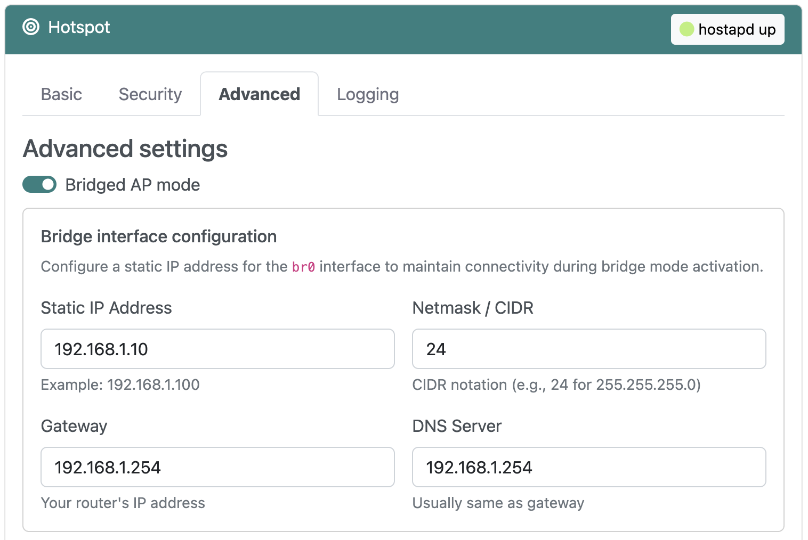

# Bridged AP mode

## Overview

By default RaspAP configures a routed AP as its hotspot, where your device creates a subnet and assigns IP addresses to connected clients. If you would rather have your upstream router assign IP addresses, RaspAP lets you change the hotspot configuration to an alternative bridged AP. This is also useful if you want your device and its hotspot clients to be visible to other devices in your router's network.

## Enabling bridged AP mode
From RaspAP's **Hotspot** > **Advanced** tab, select the **Bridged AP mode** option.  Choose **Save settings** and then **Restart hotspot**.

{: style="width:420px"}

At this stage, you will no longer be able to access RaspAP's web interface from the default `10.3.141.1` address. See [accessing the web interface](bridged.md#accessing-the-web-interface), below.
## Limitations
Bridged AP mode operates under some constraints as compared to RaspAP's default routed AP mode. These are discussed below.

### WiFi client mode
On the **Hotspot** > **Advanced** tab the **Wifi Client AP** mode option is disabled or "greyed out". The reason for this is your device cannot connect as a client to another wireless network while simultaneously hosting its own bridged access point.

### DHCP server
The **DHCP Server** page is disabled and hidden from the adminstration interface. This is because in bridged AP mode all DHCP functions are delegated to your upstream router. To configure DHCP settings for your network, access your router's web interface.

### VPN considerations
Clients connected to a bridged AP with **OpenVPN** enabled will not have their traffic routed through the VPN server. Your device itself will still have its own traffic routed through the VPN server, however.

!!!note Note
    Bridged AP mode is not currently supported on Ubuntu Server. This is because Ubuntu has [standardized on Netplan](https://ubuntu.com/blog/a-declarative-approach-to-linux-networking-with-netplan), which differs considerably from other Linux distributions supported by RaspAP.


## Accessing the web interface
In bridged AP mode, you will no longer be able to access RaspAP's web interface using the default `10.3.141.1` address. This is because your device no longer creates its own `10.3.141.0/24` subnet for its access point. Instead, access RaspAP's web interface by entering your device's hostname followed by `.local`. On Raspberry Pi devices running the `avahi` daemon, this will look like `raspberrypi.local`.

Some browsers have trouble resolving `.local` addresses. You may also need to modify the address depending on your browser. For example, try entering `http://raspberrypi.local` or `raspberrypi.local/` in your browser's address field.

If the above methods don't work, the `nmap` command (Network Mapper) can be used to scan your subnet for devices connected to your network. For example, invoke `nmap` with the `-sn` flag (ping scan) 
on your subnet range:

```
nmap -sn 192.168.1.0/24
```

This scan pings all the IP addresses in a subnet to see if they respond. For each device that responds to the ping, the output will show the hostname and IP address like so:

```
Starting Nmap 7.80 ( https://nmap.org ) at 2021-01-23 10:04 CET
Nmap scan report for iPhone 192.168.1.31
Host is up (0.037s latency).
Nmap scan report for raspberrypi 192.168.1.8
Host is up (0.031s latency).
Nmap scan report for Chromecast 192.168.1.45
Host is up (0.0015s latency).
Nmap scan report for mbp15 192.168.1.48
Host is up (0.074s latency).
Nmap done: 256 IP addresses (4 hosts up) scanned in 6.08 seconds
```

More information on finding your device's IP address can be found [here](https://www.raspberrypi.org/documentation/remote-access/ip-address.md).

## Troubleshooting
If you are unable to connect clients to your bridged AP, start by following the recommendations in [this FAQ](faq.md#bridged). Client connectivity issues in bridged AP mode are most often the result of your upstream router, not RaspAP. For this reason, please check your router's web interface and DHCP settings before reporting a bug.

## Discussions
Questions or comments about RaspAP's bridged AP mode? Join the [discussion here](https://github.com/RaspAP/raspap-webgui/discussions/).

