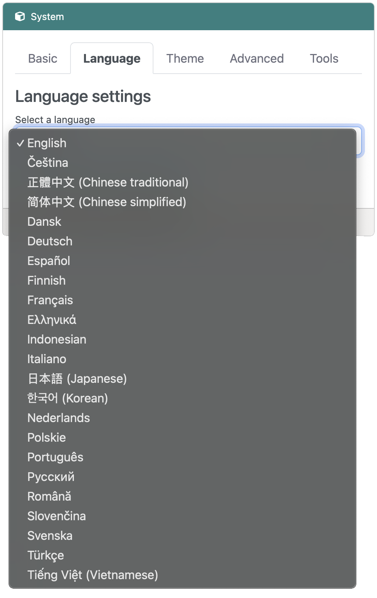

# Translations

## Overview
Owing to its utility and low cost, the Raspberry Pi's reach extends to all corners of the globe. As our way of honoring this, we've made an effort to support internationalization (often abbreviated **i18n**) with RaspAP. Given the response from [this issue](https://github.com/RaspAP/raspap-webgui/issues/121) it became obvious that translations are something that the community both wanted and were willing to contribute to.

## About locales
On Linux systems, [GNU's Gettext](https://www.gnu.org/software/gettext/) provides a standardized way of managing multi-lingual messages. RaspAP uses `gettext` to automatically detect your preferred language and serve the UI accordingly.

## Pre-built images
If you're using one of RaspAP's [pre-built OS images](../get-started/simple-setup.md#installation-method), the required locales are already installed in the system for you (via the `locales-all` package). This means RaspAP will automatically detect your browser's preferred language via the `HTTP_ACCEPT_LANGUAGE` header and display the UI in your language. No additional configuration is needed.

You can verify that all locales are available by running `locale -a` at the shell prompt. This will show an extensive list of available locales in alphabetical order.

## Manual installation
If you performed an installation of RaspAP using the [Quick installer](../get-started/quick-installer.md) or [manual steps](../get-started/manual.md), you may need to generate locales for your desired language. To list languages currently installed on your system, use `locale -a` at the shell prompt. On a fresh install of Raspberry Pi OS, this typically returns a minimal list:

```
$ locale -a
C
C.UTF-8
en_GB.utf8
POSIX
```

To generate additional locales, run `sudo dpkg-reconfigure locales` and select your desired locales. Here is a [useful list](http://www.localeplanet.com/icu/iso639.html) of ISO 639 language codes. 

!!! note "Important"
    Be sure to select `UTF-8` as this is the preferred encoding.

!!! warning "Caution"
    If you configured a new locale after installing RaspAP, you must restart the `php-fpm` service for the changes to take effect:

    ```
    sudo systemctl restart php8.4-fpm.service
    ```

## Changing languages
Whichever installation method you use, you can manually select a different language at any time from the **Language** tab in the **System** menu.

{: style="width:450px"}

Simply select a language from the list and choose **Save settings**. The UI will refresh and display the new language.

## Supported languages 

The following translations are currently maintained by the project: 

| Language | Locale | 
|---|---|
| Deutsch  | de_DE.UTF-8 |
| Dansk  | da_DK.UTF-8 |
| Français  | fr_FR.UTF-8 |
| Italiano | it_IT.UTF-8 |
| Português | pt_BR.UTF-8 |
| Svenska | sv_SE.UTF-8 |
| Nederlands | nl_NL.UTF-8 |
| 正體中文 (Chinese traditional) | zh_TW.UTF-8 |
| 简体中文 (Chinese simplified) | zh_CN.UTF-8 |
| Indonesian | id_ID.UTF-8 |
| 한국어 (Korean) | ko_KR.UTF-8 |
| 日本語 (Japanese) | ja_JP.UTF-8 |
| Tiếng Việt | vi_VN.UTF-8 |
| Čeština | cs_CZ.UTF-8 |
| Русский | ru_RU.UTF-8 |
| Polskie | pl_PL.UTF-8 |
| Română  | ro_RO.UTF-8 |
| Español | es_MX.UTF-8 |
| Finnish | fi_FI.UTF-8 |
| Türkçe  | tr_TR.UTF-8 |
| ελληνικό | el_GR.UTF-8 |

We are certainly not limited to the above. If you are willing and able to translate RaspAP in your language, you will be credited as the original translator.

## Contributing to a translation
RaspAP has a translation [project home at Crowdin](https://crowdin.com/project/raspap). This is the preferred way to contribute to our ongoing translation efforts.

### How to become a translator
The process is very straightforward. Start by signing up for a free account at [Crowdin](https://crowdin.com/). Once you are logged in, head over to our [project home](https://crowdin.com/project/raspap). 

Here you will find our supported translations, recent activity, discussions and so on. You can get started by simply choosing the language you'd like to contribute to. For more info, see Crowdin's [detailed walkthrough](https://support.crowdin.com/crowdin-intro/#translation-process) of the translation process.

## Discussions
Questions or comments about RaspAP's translations? Join the [discussion here](https://github.com/RaspAP/raspap-webgui/discussions/).
