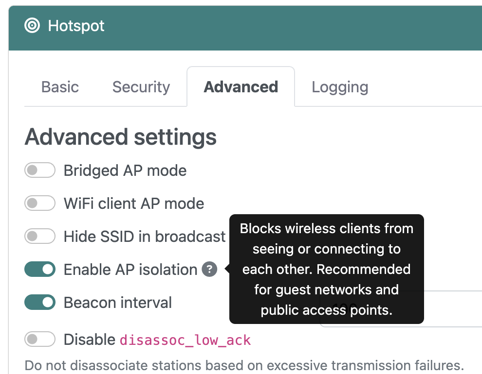

## Overview
:octicons-beaker-24: Experimental · :octicons-heart-fill-24:{: .heart } [Insiders only](index.md)

This feature implements hostapd's `ap_isolate` functionality to provide client isolation when operating a wireless access point (AP). This is a security feature that prevents wireless clients connected to the same AP from communicating directly with each other at the layer 2 level, while still allowing them to access the internet and communicate with the AP itself.

## How it works
When AP isolation is enabled, the wireless AP creates a logical barrier between connected clients via **layer 2 isolation**. This blocks direct frame forwarding between wireless clients on the same SSID. Traffic routing requires all client-to-client communication to traverse through the AP's routing layer. Finally, selective filtering maintains normal internet access and AP communication while isolating peer devices.

## Advantages
AP isolation provides several advantages for the both the AP operator and clients. The primary benefits are described below.

### Security features
Notably, security is enhanced by preventing lateral communication between compromised devices on the same network. It reduces attack surface for malicious clients attempting to exploit other connected devices, and isolates potentially untrusted guest devices from accessing other network clients. This is particularly vital if you operate a public access point.

### Network segmentation
When this mode is enabled, it creates a logical separation without requiring additional hardware or VLANs. This greatly simplifies guest network implementations. Moreover, it has the added benefit of reducing network noise and broadcast traffic between clients.

### Improved privacy
Clients are prevented from discovering and accessing shared resources on other connected devices. AP isolation also blocks direct peer-to-peer connections that could otherwise expose sensitive resources. The net effect is enhanced user privacy in public or shared wireless networks.

## Enabling AP isolation
To enable this mode, simply slide the **Enable AP isolation** toggle on the **Hotspot > Advanced** tab, then choose **Restart hotspot**.

{: style="width:450px"}

This isolation is implemented at the wireless driver level through the `hostapd` service, specifically by using the `ap_isolate=1` parameter in the `hostapd` configuration file.

## Hardware compatibility
For Raspberry Pi users, an external USB WiFi adapter is required to use this feature. WLAN chipsets with drivers that implement the necessary isolation features are required for this mode.

!!! warning "Important"
    This feature only works with external USB WiFi adapters and chipsets that support client isolation at the driver level. The `BCM43455` chipset and Broadcom driver used in Raspberry Pi 3B+ and 4B models are _not_ compatible. Your wireless AP will start and function normally, but clients will _not_ be isolated from one another.

## Tips and tricks
There’s no "capability bit" in Linux that indicates if a WLAN adapter supports AP isolation — it’s purely a `hostapd` software feature, provided the adapter can operate as an AP. For example, executing `iw list | grep -A 20 "Supported interface modes"` will display "AP" for an AP-capable adapter, but it will not expose isolation capabilities. Check the manufacturer's specifications for your adapter and verify that both the chipset _and_ driver have support for this mode.

### Verifying isolation
After starting your AP in isolation mode, obtain a list of active AP clients from RaspAP's **DHCP Server > Client list**. Alternatively, you can execute `iw dev wlan0 station dump` to list connected clients, substituting `wlan0` for your AP interface.

If AP isolation is enabled, connected clients will not be able to ping each other while they’re on the same SSID.
The only practical way to verify isolation is by connecting two devices and attempting to send network traffic between them (for example, `ping` one client from the other).

## Discussions
Questions or comments about AP isolation? Join the [discussion here](https://github.com/RaspAP/raspap-webgui/discussions/).
