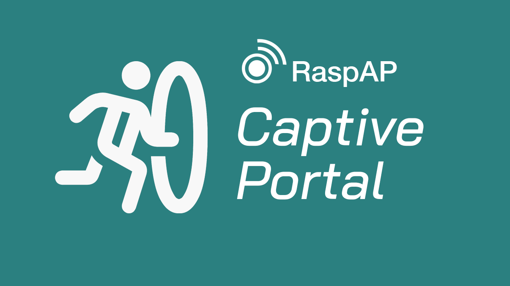
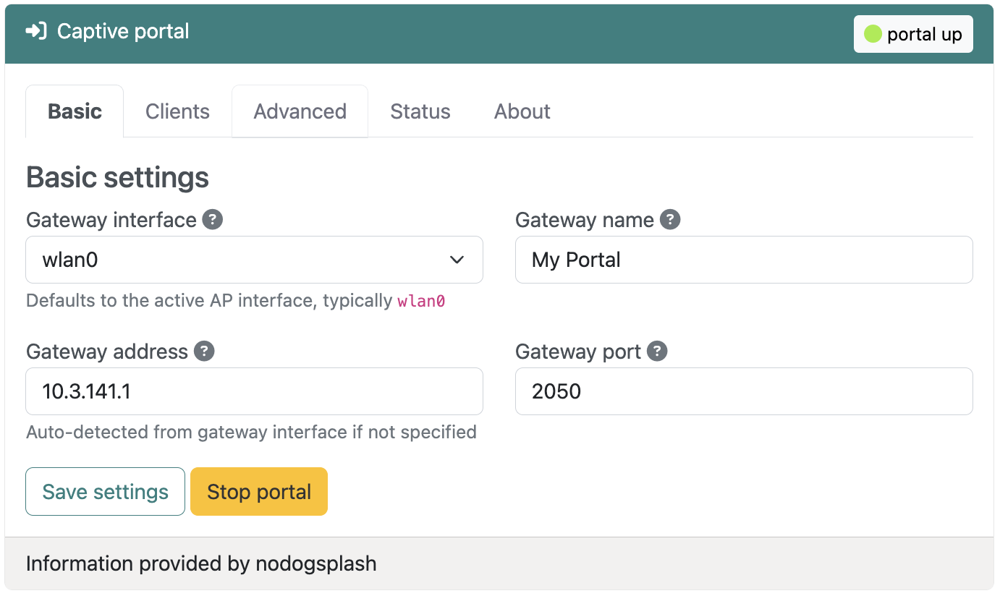
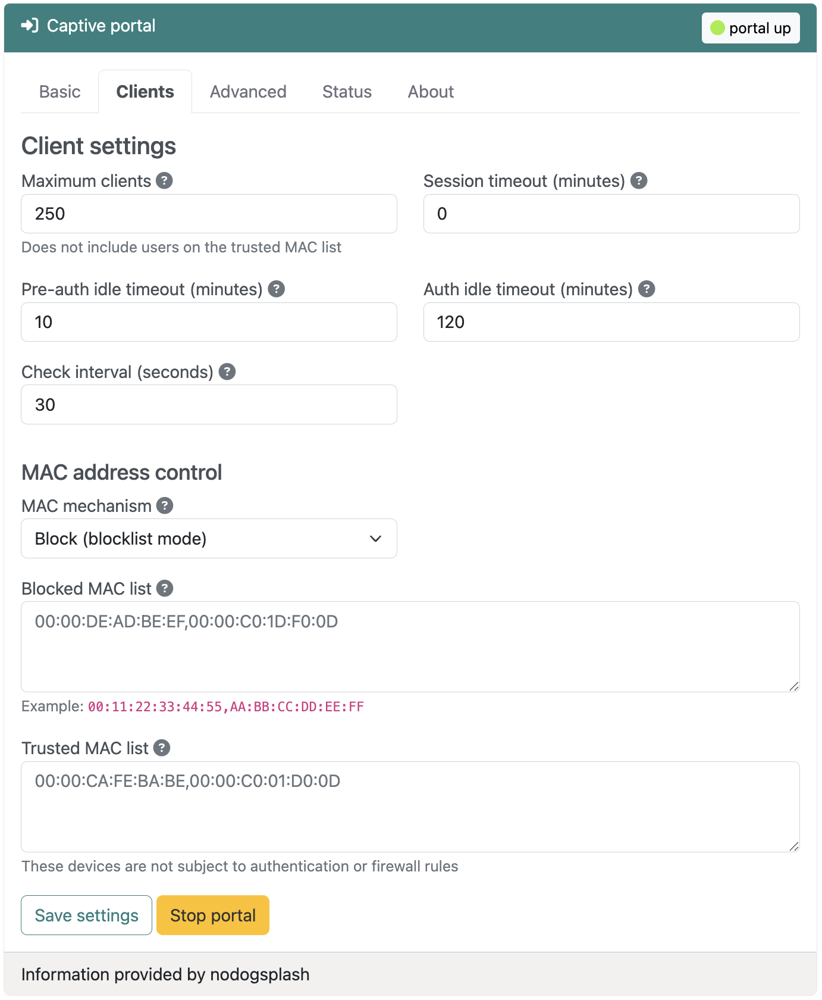
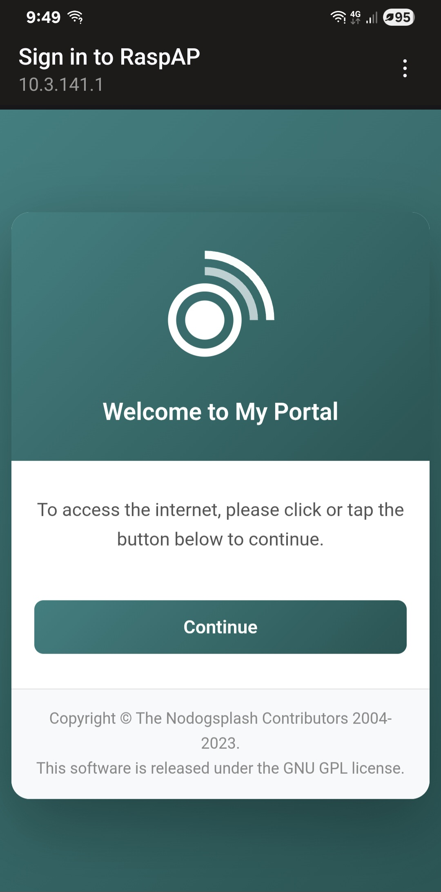

# Captive portal

{: style="width:640px"}

## Overview
:octicons-beaker-24: Experimental · :octicons-heart-fill-24:{: .heart } [Insiders only](index.md)

A captive portal is a web page that users must view and interact with before accessing a network. Usually seen in hotels, coffee shops, and public Wi-Fi hotspots, captive portals provide a way to control network access, display terms of service, collect user information, or simply welcome guests to your network.

RaspAP's captive portal plugin integrates **Nodogsplash**, a lightweight and efficient captive portal solution designed specifically for embedded Linux systems. Nodogsplash intercepts web traffic from unauthenticated clients and redirects them to a customizable splash page, where they can authenticate or accept terms before gaining network access.

## Solution
Managing public or guest Wi-Fi networks presents several challenges: controlling who accesses your network, displaying legal terms and conditions, and providing an acceptable user experience. Traditional captive portal solutions can be complex to configure and resource-intensive to run on modest hardware.

RaspAP's captive portal integration addresses these challenges by providing:

1. A web-based interface for configuring all aspects of the captive portal
2. Customizable authentication workflows and splash pages
3. MAC address-based access control with trusted device lists
4. Flexible firewall rules for authenticated and unauthenticated users
5. Many of the features of enterprise captive portals without the complexity

### Use cases
The captive portal plugin is particularly useful in these scenarios:

- **Guest Wi-Fi networks**: Provide internet access to visitors while keeping your private network secure
- **Public hotspots**: Offer Wi-Fi in cafes, libraries, or community spaces with terms of acceptance
- **Event networks**: Temporary networks for conferences, meetings, or gatherings with controlled access
- **Legal compliance**: Display and require acceptance of terms of service, acceptable use policies, or liability waivers
- **Network segmentation**: Isolate guest traffic from internal resources while providing internet access

## Installation
The captive portal integration is available as an Insiders-only plugin that may be installed from the **System > Plugins** tab. Simply choose **Details** corresponding to the plugin, then **Install now** from the pop-up dialog.

The plugin installer automates the installation of a `nodogsplash` Debian package and its dependencies, creates the necessary configuration directories, sets up default splash pages, and configures the required firewall rules and sudoers entries. When these steps are done, the installer will automatically refresh the UI. The captive portal plugin will then appear in the sidebar and is immediately available to configure.

## Configuration settings
The plugin provides a full set of options to configuring your captive portal. All user settings are saved to the Nodogsplash configuration file and persisted across system reboots.

_<small>Click image to expand</small>_ 
{: style="width:640px"}

### Basic settings
At minimum, a captive portal requires just a few parameters to function. These are shown on the **Basic settings** tab and described below.

!!! tip Tip
    If you're currently hosting an access point on your device, the plugin will automatically detect it and preconfigure the **Gateway interface** and **Gateway address** values for you. If you want to get a portal up and running quickly, simply choose **Save settings** and **Start portal**.

**Gateway interface**  
Select the network interface that the captive portal will manage. This is typically `wlan0` for most networks, if you have a single wireless interface. All traffic from this interface will be subject to captive portal authentication.

**Gateway name**  
A friendly name for your gateway that appears in the logs and in splash page templates. This is purely informational and helps identify the portal to your clients.

**Gateway address**  
The IP address of the router on the gateway interface. This is where the Nodogsplash server listens for authentication requests. This value is automatically set by the plugin if you're hosting an access point.

**Gateway port**  
The TCP port where Nodogsplash's authentication server listens. The default is `2050`. Change this if you have port conflicts with other services, but remember to update any custom splash pages that reference this port.

### Splash pages
The splash page is what users see when they first connect to your network and try to access the internet. The local directory containing your splash page files (HTML, CSS and images) is `/etc/nodogsplash/htdocs`. You can customize the splash page by editing files in this directory.

The default `splash.html` page is displayed to unauthenticated users. This page includes a simple form with a button that starts the Nodogsplash authentication process to grant network access.

After a user is authenticated, the `status.html` page is displayed which typically shows connection status and provides a logout button.

After successful authentication, users are normally redirected to their originally requested page.

_<small>Click image to expand</small>_ 
{: style="width:640px"}

### Client management
The **Client** tab has settings to control how users connect and how long they stay connected.

**Maximum clients**  
The maximum number of users that can be authenticated simultaneously. This does not include devices on the trusted MAC list. Set this based on your bandwidth capacity and expected usage.

!!! note Note
    The default maximum client value is `250`, although in practice your access point will typically host a much smaller number.

**Session timeout (minutes)**  
Automatically disconnect users after this many minutes, regardless of activity. Set to `0` for unlimited sessions. This is useful for ensuring turnover in high-traffic environments or limiting free access periods.

**Pre-auth idle timeout (minutes)**  
Remove unauthenticated users from the client list after this many minutes of inactivity. Default is `10` minutes. This prevents the system from tracking users who connected but never authenticated.

**Auth idle timeout (minutes)**  
Automatically disconnect authenticated users after this many minutes of inactivity. Default is `120` minutes (2 hours). Users can reconnect by re-authenticating through the splash page.

**Check interval (seconds)**  
How often Nodogsplash checks for timed-out clients. Default is `30` seconds. Lower values provide more responsive timeout enforcement but use slightly more CPU resources.

### MAC address control
You can control network access based on device hardware addresses. Note that MAC address filtering provides weak security since MAC addresses can be spoofed, but it's useful for convenience and basic access management.

**MAC mechanism**  
Choose between two operating modes:

- **Block (blocklist mode)**: All MAC addresses are allowed except those explicitly blocked
- **Allow (allowlist mode)**: Only explicitly allowed MAC addresses can authenticate, all others are blocked

**Blocked MAC list**  
Comma-separated MAC addresses to permanently block from the network when using block mode. Blocked devices cannot authenticate, even if they accept terms on the splash page.

Example: `00:11:22:33:44:55,AA:BB:CC:DD:EE:FF`

**Allowed MAC list**  
Comma-separated MAC addresses allowed to authenticate when using allow mode. Only these devices can access the splash page and authenticate.

**Trusted MAC list**  
Comma-separated MAC addresses that bypass authentication entirely. These devices are never redirected to the splash page and have unrestricted access. Use this for printers, IoT devices, or administrative devices that can't interact with a captive portal.

!!! note Note
    Trusted MAC addresses are not subject to any firewall rules or bandwidth limits. They have the same access as devices on your internal network.

### Firewall settings
You can also control what network services authenticated and unauthenticated users can access.

**Allow all traffic for authenticated users**  
When enabled (default), authenticated users have unrestricted access to the internet. Disable this if you want to implement custom firewall rules that limit access to specific services or websites even after authentication.

**Allow DNS for pre-authenticated users**  
When enabled (default), allows unauthenticated users to perform DNS lookups. This is required for most splash pages to function properly, as clients need to resolve domain names before they're redirected to the portal. Disabling this can help prevent DNS tunneling but may cause connectivity issues for some devices.

### Advanced options
These options permit fine-tuning of your portal for specific use cases.

**Gateway IP range**  
Specify which IP addresses on the gateway interface are managed by the captive portal, in CIDR notation. The default is `0.0.0.0/0` (all addresses). You can limit this to a specific subnet if the gateway interface serves multiple networks.

For example, use a value of `10.5.100.0/24` to only manage the 10.5.100.x subnet.

**Debug level**  
This controls the amount of logging detail reported by the `nodogsplash.service`:

- **0 - Errors only**: Log only errors and critical issues
- **1 - Errors, warnings, infos**: Standard logging (default)
- **2 - Errors, warnings, infos, verbose**: Detailed operational logging
- **3 - Errors, warnings, infos, verbose, debug**: Maximum logging for troubleshooting

Higher debug levels are useful for diagnosing issues but generate more log data. Use level 3 only when actively troubleshooting.

!!! tip Tip
    To obtain a detailed debug log, execute `sudo systemctl status nodogsplash.service` after changing these values.

## Managing the portal

### Starting the service
After configuring your desired settings, choose **Save settings** to write the configuration, then choose **Start portal** to start the Nodogsplash service. The captive portal will begin intercepting traffic immediately.

!!! warning Warning
    Starting the captive portal on an interface that's actively serving authenticated clients may disrupt their connections. Plan configuration changes during maintenance windows, or inform your users ahead of time.

### Testing the portal
To test your captive portal:

1. Connect a device to the network managed by the gateway interface
2. Many client devices will automatically redirect you to the portal splash page
3. If not, open a browser and try accessing any website
4. Complete the authentication process (click 'Continue' to accept)
5. You should be redirected to the requested page or granted internet access

{: style="width:400px"}

### Monitoring clients
The **Status** tab displays a summary of your portal's current operational status. Below this is a list of authenticated users, including:

- MAC address and IP address
- Connection time and duration
- Upload and download statistics

An example portal status output is shown below:

```
==================
NoDogSplash Status
====
Version: 5.0.2
Uptime: 7m 44s
Gateway Name: My Portal
Managed interface: wlan0
Managed IP range: 0.0.0.0/0
Server listening: http://10.3.141.1:2050
Binauth: Disabled
Preauth: Disabled
Client Check Interval: 30s
Preauth Idle Timeout: 10m 0sm
Auth Idle Timeout: 2h 0m 0s
Session Timeout: 0s
Session Timeout: 0s
Block after Session timed out: no
Traffic control: no
Total download: 465 kByte; avg: 8.02 kbit/s
Total upload: 189 kByte; avg: 3.27 kbit/s
====
Client authentications since start: 1
Current clients: 1

Client 0
  IP: 10.3.141.130 MAC: ca:52:99:a1:e2:65
  Last Activity: Fri Oct 10 00:49:44 2025 (0s ago)
  Session Start: Fri Oct 10 00:49:36 2025 (8s ago)
  Session End:   -
  Token: 1fce8669
  State: Authenticated
  Download: 448 kByte; avg: 448.30 kbit/s
  Upload:   180 kByte; avg: 180.59 kbit/s

====
Blocked MAC addresses: none
Allowed MAC addresses: N/A
Trusted MAC addresses: none
========
```

### Stopping the service
Choose **Stop service** to disable the captive portal. This will deauthenticate all current users and stop intercepting traffic. The gateway interface will continue to route traffic normally, but without the portal authentication.

## Customizing the splash page

### Default splash page
RaspAP includes a basic splash page with your gateway name and a simple "Continue" button. This provides immediate functionality, but you'll likely want to customize it for your use case.

### Custom HTML and CSS
The splash page is a standard HTML file located at `/etc/nodogsplash/htdocs/splash.html`. You can edit this file directly to:

- Add your branding and logo
- Display terms of service or acceptable use policies
- Collect user information (name or email)
- Style the page with custom CSS
- Add multiple languages

The splash page has access to several variables that Nodogsplash provides:

- `$gatewayname` - The configured gateway name
- `$authtarget` - URL to submit to for authentication
- `$imagesdir` - Path to images directory
- `$pagesdir` - Path to pages directory

### Authentication flow
A basic authentication button looks like this:

```html
<form method='get' action='$authtarget'>
  <input type='submit' value='Continue'>
</form>
```

When the user clicks this button, Nodogsplash authenticates their MAC address and redirects them to their intended destination.

### Advanced splash pages
You can create sophisticated splash pages that:

- Validate email addresses or phone numbers
- Integrate with external authentication systems via the BinAuth script
- Display dynamic content based on time of day or network conditions
- Track analytics on portal usage
- Implement rate limiting or device fingerprinting

See the [Nodogsplash documentation](https://nodogsplash.readthedocs.io/en/latest/) for detailed information on splash page development.

## Tips and tricks

### Guest network best practices

**Separate SSIDs**  
Create a dedicated Wi-Fi SSID for guest access. This makes it clear which network requires captive portal authentication and provides network segmentation.

**Clear naming**  
Use descriptive SSID names like "Guest-WiFi" or "Cafe-Public" so users understand this is a guest network with potential restrictions.

### Legal considerations
Always include clear terms of service on your splash page. Do your own research about legal requirements in your jurisdiction. At the same time, consider your local privacy laws regarding network logging. The captive portal logs MAC addresses, connection times, and basic traffic statistics related to your clients.

Many public networks include liability waivers on their splash pages. Again, do your own research for proper wording.

### Security considerations
Bear in mind that MAC address filtering can be bypassed through spoofing. Don't rely on it for security-critical applications.

Always isolate guest network traffic from internal resources using proper firewall rules. The captive portal controls internet access, but additional [firewall rules](../features-core/firewall.md) may be needed to protect local resources.

## Troubleshooting
Is your portal is behaving unexpectedly? Begin by checking its status on the **Status** tab. If the status indicates it's running, increase the debug log level on the **Advanced** tab and stop the portal service. Next, execute the following in the shell:

```
journalctl -u nodogsplash.service -f
```

Return to the plugin and choose **Start portal**, or execute `sudo systemctl start nodogsplash.service`. You should receive detailed debug information about the portal's service. Use a ++ctrl+c++ keystroke to exit `journalctl`.

Most common issues have been addressd and resolved in the [Nodogsplash GitHub repository](https://github.com/nodogsplash/nodogsplash/issues).

## Discussions
Questions or comments about using the captive portal plugin? Join the [discussion here](https://github.com/RaspAP/raspap-webgui/discussions/).