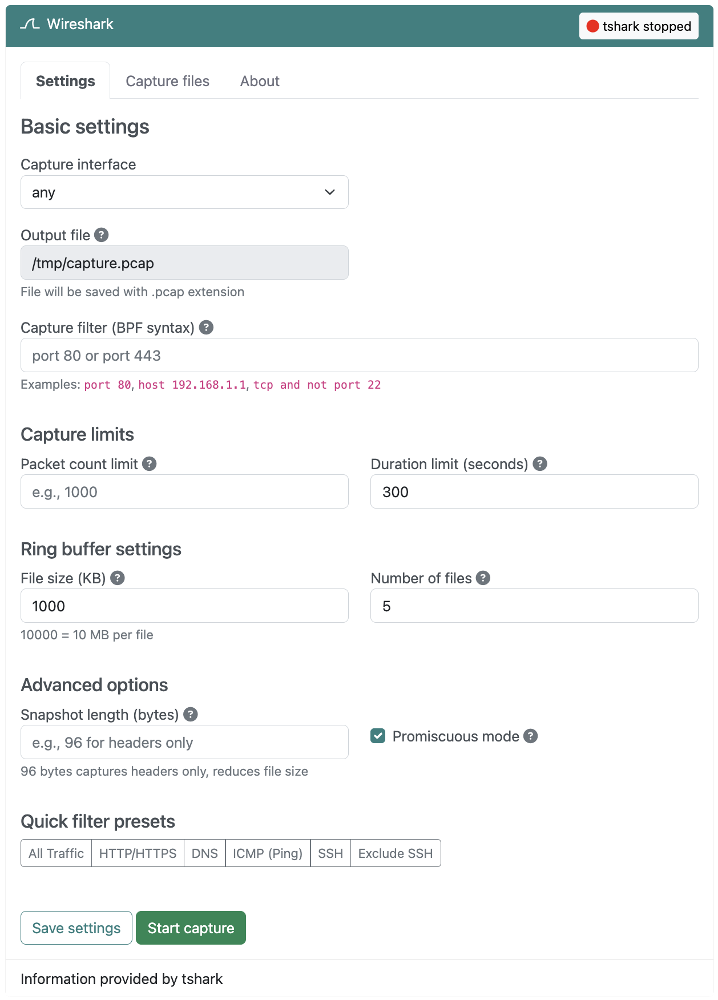
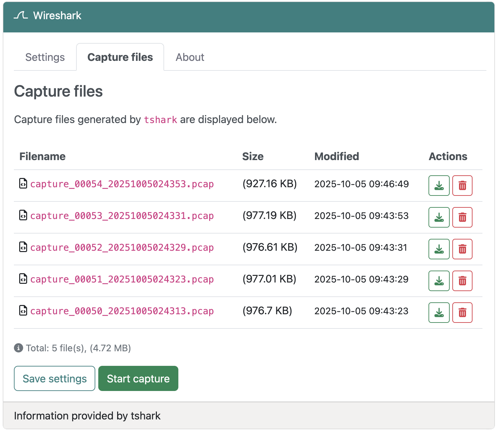

# Wireshark support

{: style="width:640px"}

## Overview
:octicons-beaker-24: Experimental · :octicons-heart-fill-24:{: .heart } [Insiders only](index.md)

Wireshark is the world's most popular network protocol analyzer. While Wireshark provides a full graphical interface for interactive packet analysis, its command-line version **TShark** operates entirely from the shell. This makes it ideal for headless systems, and transforms devices like the Raspberry Pi into a powerful tool for network packet capture.

TShark captures and analyzes network traffic in real-time, supporting hundreds of protocols and offers powerful filtering capabilities without the overhead of a GUI.
  
## Solution
Network troubleshooting and security analysis often requires capturing packets to diagnose connectivity issues, identify suspicious traffic, or optimize network performance. However, running a full GUI-based packet analyzer on a headless device or through SSH can be impractical or impossible.

RaspAP's TShark integration addresses this challenge by providing:

1. A web-based interface for configuring and managing packet captures
2. Support for Berkeley Packet Filter (BPF) syntax to capture specific traffic
3. Automated capture management with ring buffers and limits
4. Secure download of capture files for offline analysis
5. All the power of Wireshark's capture engine without GUI requirements

### Use cases
The TShark plugin is particularly useful in these scenarios:

- **Troubleshooting connectivity issues**: Capture DNS queries, DHCP exchanges, or failed connection attempts
- **Security monitoring**: Identify unauthorized traffic, port scans, or suspicious patterns
- **Performance analysis**: Diagnose latency issues, packet loss, or bandwidth utilization
- **Protocol debugging**: Examine application-level protocols like HTTP, MQTT, or custom services
- **Network documentation**: Create packet captures for reference or compliance purposes

!!! tip Tip
    Packet captures can grow large very quickly on busy networks. For this reason, the plugin's default settings define a duration limit of 300 seconds (5 minutes). You may of course modify this setting, or use capture filters to limit what's captured. Ring buffers are also supported to automatically rotate files and manage disk space.

## Installation
RaspAP's TShark packet capture integration is available as an Insiders-only plugin that may be installed from the **System > Plugins** tab. Simply choose **Details** corresponding to the plugin, then **Install now** from the pop-up dialog.

The plugin installer automates the installation of the `tshark` package and its dependencies, configures the necessary permissions for packet capture, and sets up the required sudoers entries. When these steps are done, the installer will automatically refresh the UI. The Wireshark plugin will then appear in the sidebar and is immediately available to configure.

## Capture settings
The Wireshark plugin provides comprehensive options for configuring packet captures. All settings are preserved between captures, but are not persisted across system reboots.

_<small>Click image to expand</small>_ 
{: style="width:640px"}

### Basic settings

**Interface**  
Select the network interface to capture packets from. This can be any active interface on your system, including ethernet (`eth0`), wireless (`wlan0`), or the special `any` interface to capture from all interfaces simultaneously.

**Output file**  
This read-only setting indicates the path where capture files will be saved. Files are saved in a standard `.pcap` format, which is compatible with Wireshark and other packet analysis tools. The default capture file storage location is `/tmp`.

**Capture filter (BPF syntax)**  
You can use the [Berkeley Packet Filter syntax](https://www.ibm.com/docs/en/qsip/7.4?topic=queries-berkeley-packet-filters) to capture only specific traffic. Leave this field empty to capture all traffic. Capture filters are applied during capture to reduce the amount of data saved to disk.

Common filter examples:

- `port 80` - Capture HTTP traffic only
- `host 192.168.1.1` - Capture traffic to/from a specific host
- `tcp and not port 22` - Capture all TCP except SSH
- `port 53` - Capture DNS queries and responses
- `icmp` - Capture ping traffic only

!!! note Note
    TShark capture filters use BPF syntax and are applied at the kernel level during capture. This is different from display filters (used in Wireshark) which are applied after capture. For best performance, use capture filters to limit what's saved to disk.

### Capture limits

**Packet count limit**  
Stop the capture automatically after capturing a specified number of packets. Leave empty for unlimited capture. This is useful when you need a sample of network traffic without filling up disk space.

**Duration limit (seconds)**  
Stop the capture automatically after a specified number of seconds. This is useful for capturing traffic during a specific time window, such as during application startup or a network event.

### Ring buffer settings
Ring buffers allow you to capture continuously while automatically rotating files and managing disk space. This is essential for long-running captures on systems with limited storage.

**File size (KB)**  
Create a new file when the current file reaches this size. For example, setting this to `10000` (10 MB) will create a new file every 10 megabytes of captured data.

**Number of files**  
Maximum number of ring buffer files to keep. When this limit is reached, the oldest file is automatically deleted to make room for new captures. For example, with a 10 MB file size and 5 files, you'll maintain approximately 50 MB of the most recent traffic.

### Advanced options

**Snapshot length (bytes)**  
Limit the amount of data captured per packet. The default captures entire packets, but you can specify a smaller value to capture only packet headers. For example, `96` bytes is sufficient to capture Ethernet, IP, and TCP/UDP headers without payload data. This significantly reduces file size when you only need header information.

**Promiscuous mode**  
When enabled (default), the network interface captures all packets on the network segment, not just those destined for this device. This is required for capturing traffic between other devices on your network. Disable this setting to capture only traffic sent to or from this device.

### Quick filter presets
The plugin includes convenient preset buttons for common capture scenarios:

- **All Traffic** - Clear filters and capture everything
- **HTTP/HTTPS** - Capture web traffic on ports 80 and 443
- **DNS** - Capture DNS queries and responses
- **ICMP (Ping)** - Capture ping traffic
- **SSH** - Capture SSH connections
- **Exclude SSH** - Capture everything except SSH (useful when accessing RaspAP via SSH)

## Managing captures

### Starting a capture
After configuring your desired settings, choose **Save settings** to preserve your configuration. To begin capturing packets, choose **Start capture**. The capture will run in the background until it reaches any configured limits or until you manually stop it.

!!! warning Warning
    Starting a new capture while one is already running will fail. Stop the current capture before starting a new one.

### Stopping a capture
Choose **Stop capture** to end the current packet capture. TShark will gracefully close the capture file, ensuring all buffered packets are written to disk. The capture file, or files, will then be available for download.

### Capture files
The **Capture files** tab displays all `.pcap` and `.pcapng` files in the `/tmp` directory. The properties of each file is shown, including:

- **Filename** - The name of the capture file
- **Size** - Human-readable file size (B, KB, MB, GB)
- **Modified** - Timestamp of when the file was last modified
- **Actions** - Download or delete the file

_<small>Click image to expand</small>_ 
{: style="width:640px"}

**Downloading captures**  
Click or tap the **Download** button to securely download the capture file to your local machine. The file can then be opened in Wireshark for detailed analysis with its graphical interface.

**Deleting captures**  
Click or tap the **Delete** button to remove a capture file. A confirmation dialog will appear before deletion. This is useful for managing disk space after you've finished analyzing a capture.

!!! tip Tip
    Capture files stored in `/tmp` are automatically deleted on system reboot. Download important captures before rebooting your device.

## Tips and tricks

### Analyzing captures with Wireshark
After downloading a capture file, open it in Wireshark on your desktop computer for powerful graphical analysis. Wireshark provides features like protocol dissection, stream reassembly, expert analysis, and graphical statistics that complement TShark's capture capabilities.

### Using Termshark
[Termshark](https://termshark.io/) is a terminal user interface (TUI) for TShark that brings Wireshark-like functionality to the command line. If you prefer working directly on your Raspberry Pi via SSH, install Termshark for an interactive packet analysis experience:

```
sudo apt update
sudo apt install termshark
```

Open any capture file with:

```
sudo termshark -r /tmp/capture.pcap
```

Termshark provides a split-pane interface with packet list, packet details, and hex dump views — all navigable with keyboard shortcuts.

### Capture filter strategies

**Start broad, filter narrow**  
Begin with a broad capture (no filter) to understand overall network traffic, then use increasingly specific filters to isolate the traffic you're interested in.

**Exclude your management traffic**  
When accessing RaspAP via SSH or HTTPS, exclude this traffic from captures to reduce noise:

```
not port 22 and not port 443
```

**Combine filters with boolean operators**  
Build complex filters using `and`, `or`, and `not`:

```
(tcp port 80 or tcp port 443) and host 192.168.1.100
```

### Managing disk space

**Use ring buffers for continuous capture**  
Set a file size of 10-50 MB and keep 5-10 files for continuous monitoring without filling up your SD card. These guidelines will necessarily depend on the available free storage on your SD card.

!!! tip Tip
    When in doubt, you can find the storage used by your device on RaspAP's **System > Basic** tab.

**Capture headers only**  
Set snapshot length to 96 bytes when you don't need payload data. This dramatically reduces file size while preserving all header information for most protocols.

**Clean up old captures**  
Regularly delete capture files you no longer need from the **Capture files** tab.

### Remote capture workflow
Here's a common workflow for remote packet analysis:

1. Configure capture settings in RaspAP's web interface
2. Start the capture and let it run (optionally with time/packet limits)
3. Stop the capture when complete
4. Download the capture file to your local machine
5. Analyze the capture in Wireshark with its full graphical interface
6. Delete the capture file from RaspAP to free up space

This workflow combines the convenience of remote capture with the power of desktop analysis tools.

### Security considerations

**Captures contain sensitive data**  
Packet captures may contain passwords, cookies, API keys, and other sensitive information transmitted over the network. Handle capture files with the same care as system logs or database backups.

**Use HTTPS for access**  
When downloading captures over the network, ensure you're accessing RaspAP [via HTTPS](../features-core/ssl.md) to encrypt the download.

**Limit capture scope**  
Use capture filters to avoid capturing more traffic than necessary. For example, if troubleshooting a specific application, filter for only that application's traffic.

## Troubleshooting

### Capture files not appearing
Capture files are saved to the volatile `/tmp` directory by default. Verify the output file path in your capture settings and ensure the directory exists and is writable.

### High CPU usage
Capturing on busy networks can be CPU-intensive. To reduce overhead:

- Use specific capture filters to limit captured traffic
- Enable UDP throughput optimization for high-volume captures
- Reduce snapshot length to capture only headers
- Use ring buffers with smaller file sizes

### Download issues
Most browsers will raise a warning when attempting to download a file over an insecure connection. Given that `.pcap` files may contain sensitive information, it's strongly recommended to install an [SSL certificate](../features-core/ssl.md) on your RaspAP host to enable encrypted downloads. Alternatively, use common secure Linux tools like `scp` or `sftp` to transfer files from your device for analysis.

## Discussions
Questions or comments about using TShark's packet capture? Join the [discussion here](https://github.com/RaspAP/raspap-webgui/discussions/).