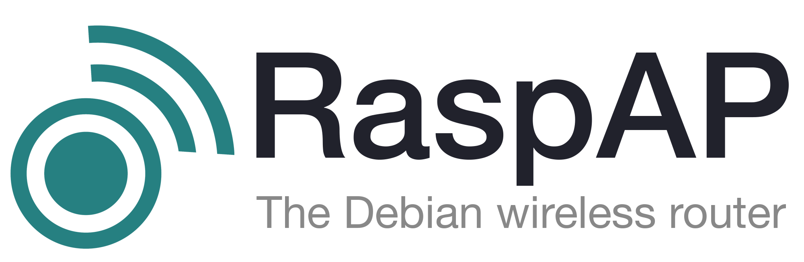

# Overview

{: style="width:480px"}

Simple AP setup & WiFi management for Debian-based devices

## About
RaspAP is feature-rich wireless router software that _just works_ on many popular [Debian-based devices](#compatible-operating-systems), including the Raspberry Pi.
Our popular [pre-built images](get-started/simple-setup.md#installation-method), [Quick installer](get-started/quick-installer.md) and [Docker container](get-started/docker.md) create a known-good default configuration in minutes on all current Raspberry Pis with onboard wireless.

## Compatible operating systems
RaspAP was originally made for Raspbian, but now also installs on the following Debian-based distros.

| Distribution | Release  | Architecture | Support |
|---|:---:|:---:|:---:|
| Raspberry Pi OS Lite | 64-bit Debian 13 (trixie)  | ARM | Official |
| Raspberry Pi OS Lite | 32-bit Debian 13 (trixie)  | ARM | Official |
| Raspberry Pi OS Lite | 64-bit Debian 12 (bookworm) | ARM | Official |
| Raspberry Pi OS Lite | 32-bit Debian 12 (bookworm) | ARM | Official |
| Raspberry Pi OS Desktop| 64-bit Debian 12 (bookworm) | ARM | Official |
| Raspberry Pi OS Lite | 64-bit  Debian 11 (bullseye) | ARM | Official |
| Raspberry Pi OS Lite | 32-bit Debian 11  (bullseye) | ARM | Official |
| Armbian | 23.11  (jammy) | [ARM](https://www.armbian.com/rpi4b/) | Beta |
| Debian  |  bookworm | ARM / x86_64  | Beta |

{: style="width:480px"}

You are also encouraged to use RaspAP's community-led [Docker container](get-started/docker.md).

!!! tip "Tip"
    If maximizing the number of AP clients is a top priority, you can switch to an alternative RPi OS minimal firmware that has been specifically tuned for this purpose. Details are available in [this FAQ](faq.md#maxclients).

Please note that "supported" is not a guarantee. If you are able to improve support for your preferred distro, we encourage you to [actively contribute](#get-involved) to the project.

## Get involved
We welcome all users of RaspAP to contribute to the project. This can take the form of [issue reports](https://github.com/RaspAP/raspap-webgui/issues), [discussions](https://github.com/RaspAP/raspap-webgui/discussions), or [pull requests](https://github.com/RaspAP/raspap-webgui/pulls).
Developers can get started by following these steps:

1. Fork the project in your account and create a new branch: `your-great-feature`.
2. Open an issue in the repository describing the feature contribution you'd like to make.
3. Commit changes in your feature branch.
4. Open a pull request and reference the initial issue in the pull request message.

Find out more about our [coding style guidelines and recommended tools](https://github.com/RaspAP/raspap-webgui/blob/master/CONTRIBUTING.md).

## Get Insiders
RaspAP is free software, but powered by your support. If you find RaspAP useful for your personal or commercial projects, [become a sponsor](features-insiders/index.md#how-to-become-a-sponsor)
and get access to [exclusive features](features-insiders/index.md#whats-in-it-for-me) in the :octicons-heart-fill-24:{: .heart } [Insiders Edition](features-insiders/index.md).

## Discussions
Questions or comments about the Quick start? Join the [discussion here](https://github.com/RaspAP/raspap-webgui/discussions/).

