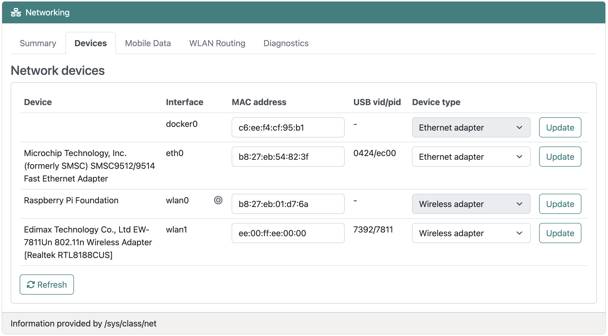
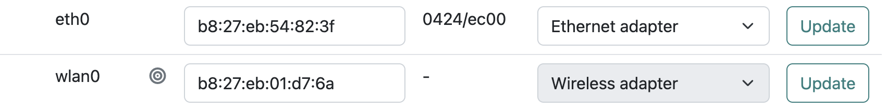
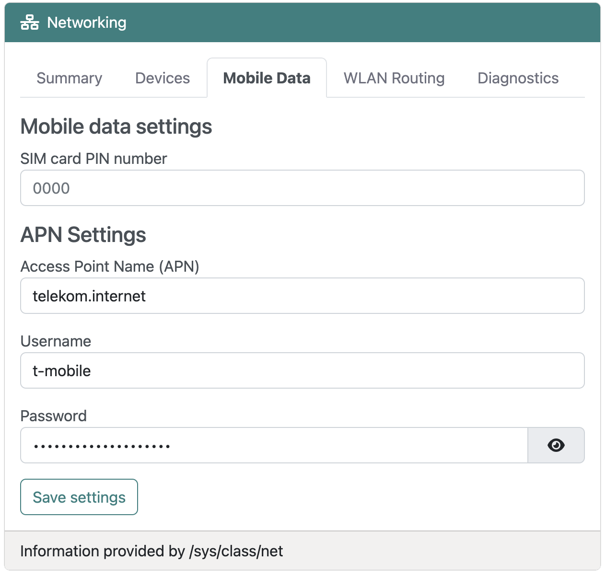

# Network devices

## Overview
:octicons-beaker-24: Experimental · :octicons-heart-fill-24:{: .heart } [Insiders only](insiders.md)

[Insiders](insiders.md) are able to manage a variety of physical network devices as a source of data connectivity for RaspAP.
Broadly, this includes devices such as tethered phones, USB modems/routers, WLAN adapters and so on. This expands the practicality of RaspAP as a truly mobile AP for travel and/or field applications. 

## Supported device types
The following network devices are supported:

- Ethernet interface (eth)
- Wireless adapter (wlan)
- Mobile data modem (ppp)
- Mobile data adapter with built-in router
- USB connected smartphone (USB tethering)  

!!! note "Note"
    All devices require a compatible Linux driver in order to be available for use with RaspAP. 

## Listing detected devices
The **Networking > Devices** tab displays a list of available devices with their attributes and assumed adapter type. Incorrect device types might appear for some devices, which advertise themselves to the system as an ethernet (for example, `eth0`) or usb (`usb0`) device. This often happens for USB connected phones and external routers.  

### Changing the device type
The type may be changed for devices with an associated Vendor ID (vid) and Product ID (pid). To modify a device's type, select an option from the **Device type** drop-down and choose **Update**.

This will read from RaspAP's canonical UDEV [prototype definitions](net-devices.md#configuration-files) and assign the desired type to the device. These values are persisted in RaspAP's custom UDEV rules located in `/etc/udev/rules.d/80-raspap-net-devices.rules`. 

### Changing the MAC address
Sometimes you might need to set the MAC address of the WLAN interface to be the same as your PC or some other device on your network. This is known as _MAC address cloning_.

For example, some ISPs register your computer's MAC address when the service is first installed. When you place a router behind the cable or ADSL modem, the MAC address from the device WLAN port will not be recognized by the ISP.

External networking devices, like a Raspberry Pi, also have their own MAC addresses which can create authentication problems. This often occurs on guest Wi-Fi networks.

You can clone the MAC address of the WLAN interface (or any other valid interface) to be the same as your computer's MAC address. To create this configuration, follow the steps below:

1. Open the **Networking > Devices** tab.
2. Choose a MAC address for the interface you wish to clone.
3. Enter a valid address in the **MAC** field and choose **Update**.
4. The new MAC address will be configured immediately.

!!! note "Note"
    Virtual interfaces such as OpenVPN's `tun0` or WireGuard's `wg0` do not have this capability. To avoid potential conflicts, change the MAC address and reconnect the device before modifying any other settings. 

## Ethernet interfaces
The built-in ethernet adapter as well as USB adapters are usually detected automatically. In these cases no configuration is required.
Devices such as USB tethered phones might appear as an ethernet device as well. The same applies to mobile data adapters that also contain a router.

In these cases, the type may be adjusted in the device list and a name assigned to the device. This will have an effect on the network device widget shown on the dashboard.

## Wireless network devices
These devices are usually listed with the automatically assigned device name prefix **wlan**, for example `wlan0`. If multiple wlan interfaces are used, it can be advantageous to assign a unique
name to the device.
 
Wireless devices will only appear if a supported driver exists in the currently installed OS. If your device does not appear in the list, this usually indicates that a required device driver is missing.

## Mobile data modems
Modems or Point-to-Point Protocol (`ppp`) devices require login data. This includes a PIN number to unlock the SIM card, the Access Point Name (APN) and login data of your mobile network provider. 
These values may be entered under the **Networking > Mobile Data** tab.

{: style="width:375px"}

Enter the SIM card PIN number, specify the your provider's APN and login credentials, then choose **Save settings**.

Values entered here are stored in the file `/etc/wvdial.conf`. This configuration file contains the basic configuration needed to unlock the SIM card and connect
to the network. This has been tested with a Huawei E1550. If your device requires different AT-commands, you will need to manually change this configuration. 

!!! note "Note"
    The names of modems cannot be changed. The reason is that the device name `ppp0` is directly coupled with the required system services.

### What if my modem device doesn't appear?
In this case your connected modem device is not recognized by the OS, or it has not been switched into modem mode by [usb_modeswitch](https://www.draisberghof.de/usb_modeswitch/).
Check the log file (`journalctl`) for problems with the device. 

## Mobile data adapters with built-in routers
Mobile data USB devices which provide router functionality will usually appear as an ethernet device, for example `eth1`. This implies that the device has to be pre-configured
to work without a PIN for the SIM card and without login data. Typically, this can be done via a browser based administration interface on any computer.

### Huawei Hilink Device
A special case are Huawei Hilink devices (e.g. Huawei E3372h-320). RaspAP can communicate directly with these devices. Be sure that the administration interface is _not_ locked with a user/password.
The PIN number entered on the **Networking > Mobile Data** tab will be used to unlock the SIM card. The model E3372h-320 will be detected as a **Hilink** device and appears with the name `hilink0`. Other Hilink devices require a corresponding assignment on the **Networking > Devices** tab.

## USB tethered phones
A phone connected via USB and with USB tethering enabled will appear as either an ethernet device (e.g. `eth1`), or as a USB network device (e.g. `usb0`).
Changing the device type to **phone** will result in a corresponding display on the dashboard. In this case the default name is `phone0`.

## Configuration files
- All device specific settings are stored as UDEV rules in the file `/etc/udev/rules.d/80-raspap-net-devices.rules`.
- The templates for the UDEV rules are stored in `/etc/raspap/networking/client_udev_prototypes.json`. This file contains the list of recognized device types.
- Mobile data settings are stored in: `/etc/raspap/networking/mobiledata.ini`
- Modem AT-commands and login data are stored in: `/etc/wvdial.conf`

## Diagnostics
A built-in tool to evaluate network performance is available on the **Networking > Diagnostics** tab. This permits testing of both local network throughput (that is, data transfer over a wired or wireless interface between RaspAP and a connected client) and internet speed (data transfer between a RaspAP instance and remote host). Ping, jitter download and upload metrics are included in the test.

<video src="https://user-images.githubusercontent.com/229399/214792331-4656d482-7c4d-4ca9-853d-2d1718ddf62d.mov" controls="controls" muted="muted"></video>

The remote host is RaspAP's public [speedtest server](https://speedtest.raspap.com/) located in the United States. Additional speedtest hosts distributed in other geographic centers are forthcoming.

## Discussions
Questions or comments about network devices support? Join the [discussion here](https://github.com/RaspAP/raspap-webgui/discussions/).
