# SSL certificates

{: style="width:640px"}

## Overview
HTTPS prevents network attackers from observing or injecting page contents. This is desirable for server applications like RaspAP &#151; or indeed any locally hosted web application. But HTTPS requires [TLS certificates](https://en.wikipedia.org/wiki/Transport_Layer_Security), and while deploying public websites is largely a solved issue thanks to the ACME protocol and Let's Encrypt, local web servers still mostly use HTTP because no one can get a universally valid certificate for localhost.

## Locally trusted certificates 
Managing your own Certificate Authority (CA) is the best solution, but this usually requires an involved manual setup routine. An excellent solution for local websites is [mkcert](https://github.com/FiloSottile/mkcert). This is a zero-config tool for making locally-trusted certificates with any name you like. `mkcert` automatically creates and installs a local CA in the system root store and generates locally-trusted certificates. It also works perfectly well with RaspAP. This allows you to generate a trusted certificate for a hostname (for example, `raspap.local`) or IP address because it only works for you. 

{: style="width:450px"}

Here's the twist: it doesn't generate self-signed certificates, but certificates signed by your own private CA. This tool does not automatically configure servers or mobile clients to use the certificates though. There are some steps for macOS and Windows are covered in the [Client Configuration](#client-configuration) section below.

Read more about mkcert [here](https://blog.filippo.io/mkcert-valid-https-certificates-for-localhost/) and [follow the project on GitHub](https://github.com/FiloSottile/mkcert).

## Creating a certificate
There are two options to go about creating a self-signed certificate with mkcert: 1) manually, or 2) with the 'Quick Installer'. Both methods are described below.

=== "Manual steps"

    Follow the steps below to generate and install a locally-trusted certificate for RaspAP. The local domain `raspap.local` is used in the examples below. You may substitute this with the default `raspberrypi.local` or your own hostname. 

    !!! tip "Tip"
        If you've changed your hostname prior to starting this process, be sure to reboot your device for the change to take effect.

    Start by installing the pre-built binary for Arch Linux ARM on your Raspberry Pi:
    ```
    sudo wget https://github.com/FiloSottile/mkcert/releases/download/v1.3.0/mkcert-v1.3.0-linux-arm -O /usr/local/bin/mkcert
    sudo chmod +x /usr/local/bin/mkcert
    mkcert -install
    ```
    You should see output like the following:
    ```
    Using the local CA at "/home/pi/.local/share/mkcert" ✨
    The local CA is now installed in the system trust store! ⚡️
    ```
    Generate a certificate for `raspap.local`:
    ```
    cd /home/pi
    mkcert raspap.local "*.raspap.local" raspap.local
    ```
    You should see output like the following:
    ```
    Using the local CA at "/home/pi/.local/share/mkcert" ✨

    Created a new certificate valid for the following names 📜
    - "raspap.local"
    - "*.raspap.local"
    - "raspap.local"

    Reminder: X.509 wildcards only go one level deep, so this won't match a.b.raspap.local ℹ️
    The certificate is at "./raspap.local+2.pem" and the key at "./raspap.local+2-key.pem" ✅
    ```
    Next, combine the private key and certificate:
    ```
    cat raspap.local+2-key.pem raspap.local+2.pem > raspap.local.pem
    ```
    Create a directory for the combined `.pem` file in lighttpd:
    ```
    sudo mkdir /etc/lighttpd/ssl
    ```
    Set permissions and move the `.pem` file:
    ```
    chmod 400 /home/pi/raspap.local.pem
    sudo mv /home/pi/raspap.local.pem /etc/lighttpd/ssl
    ```
    Edit the lighttpd configuration with `sudo nano /etc/lighttpd/lighttpd.conf`. Add the following block to enable SSL with your new certificate:

    ```
    server.modules += ("mod_openssl")
    $SERVER["socket"] == ":443" {
      ssl.engine = "enable"
      ssl.pemfile = "/etc/lighttpd/ssl/raspap.local.pem"
      ssl.ca-file = "/home/pi/.local/share/mkcert/rootCA.pem"
      server.name = "raspap.local"
      server.document-root = "/var/www/html"
    }
    ```

    Optionally, you can redirect all HTTP requests to HTTPS like so:
    ```
    $SERVER["socket"] == ":80" {
      $HTTP["host"] =~ "(.*)" {
        url.redirect = ( "^/(.*)" => "https://%1/$1" )
      }
    }
    ```
    Save your changes and quit out of the editor with ++ctrl+x++ followed by ++y++ and finally ++enter++.

    Restart the lighttpd service:
    ```
    sudo systemctl restart lighttpd
    ```
    Verify that lighttpd has restarted without errors:
    ```
    sudo systemctl status lighttpd
    ```
    You should see a response like the following:
    ```
    ● lighttpd.service - Lighttpd Daemon
        Loaded: loaded (/lib/systemd/system/lighttpd.service; enabled; vendor preset: enabled)
        Active: active (running) since Sun 2023-03-26 10:09:46 CEST; 5 days ago
      Main PID: 1080 (lighttpd)
          Tasks: 6 (limit: 779)
            CPU: 5min 17.332s
        CGroup: /system.slice/lighttpd.service
                ├─1080 /usr/sbin/lighttpd -D -f /etc/lighttpd/lighttpd.conf
                ├─1168 /usr/bin/php-cgi
                ├─1185 /usr/bin/php-cgi
                ├─1186 /usr/bin/php-cgi
                ├─1187 /usr/bin/php-cgi
                └─1188 /usr/bin/php-cgi

    Mar 30 18:23:38 raspap lighttpd[1433]: Syntax OK
    Mar 30 18:23:38 raspap systemd[1]: Started Lighttpd Daemon.
    ```
    Now, copy `rootCA.pem` to your lighttpd web root:
    ```
    sudo cp /home/pi/.local/share/mkcert/rootCA.pem /var/www/html
    ```

    !!! warning "Important"
        **Do not** share the private key file (default name is `rootCA-key.pem`).

    Finish by following the [client configuration](#client-configuration) steps below.

=== "Quick installer"

    The [Quick Installer](quick.md) may also be used to generate SSL certs with `mkcert`. The installer automates the manual steps described above, including configuring lighttpd with SSL support. It's recommended to review these steps to have an idea of what is happening behind the scenes. 

    Invoke the Quick installer and specify the `-c` or `--cert` option, like so:

    ```
    curl -sL https://install.raspap.com | bash -s -- --cert
    ```

    !!! note "Note"
        Executing the Quick installer only installs `mkcert` and generates an SSL certificate with the input you provide. It does _not_ (re)install RaspAP. 

    ```
    $ curl -sL https://install.raspap.com | bash -s -- --cert


    888888ba                              .d888888   888888ba
    88     8b                            d8     88   88     8b
    a88aaaa8P' .d8888b. .d8888b. 88d888b. 88aaaaa88a a88aaaa8P
    88    8b. 88    88 Y8ooooo. 88    88 88     88   88
    88     88 88.  .88       88 88.  .88 88     88   88
    dP     dP  88888P8  88888P  88Y888P  88     88   dP
                                88
                                dP      version 3.2.1

    The Quick Installer will guide you through a few easy steps


    RaspAP mkcert: Configure a new SSL certificate
    Current system hostname is raspap
    Create an SSL certificate for raspap.local? (Recommended) [y/N] y
    Install to lighttpd SSL directory: /etc/lighttpd/ssl? [y/N]: y
    ***************************************************************
    A new SSL certificate for: raspap.local
    will be installed to lighttpd SSL directory: /etc/lighttpd/ssl
    ***************************************************************
    Complete installation with these values? [y/N]: y
    RaspAP mkcert: Fetching mkcert binary
    RaspAP mkcert: Installing mkcert
    Using the local CA at "/home/pi/.local/share/mkcert" ✨
    The local CA is already installed in the system trust store! 👍
    Warning: "certutil" is not available, so the CA can't be automatically installed in Firefox and/or Chrome/Chromium! ⚠️
    Install "certutil" with "apt install libnss3-tools" and re-run "mkcert -install" 👈

    RaspAP mkcert: Generating a new certificate for raspap.local
    Using the local CA at "/home/pi/.local/share/mkcert" ✨
    Warning: the local CA is not installed in the Firefox and/or Chrome/Chromium trust store! ⚠️
    Run "mkcert -install" to avoid verification errors ‼️
    Created a new certificate valid for the following names 📜
    - "raspap.local"
    - "*.raspap.local.local"
    - "raspap.local"

    Reminder: X.509 wildcards only go one level deep, so this won't match a.b.raspap.local.local ℹ️

    The certificate is at "./raspap.local+2.pem" and the key at "./raspap.local+2-key.pem" ✅
    ```

    The installer will guide you through the steps of creating a certificate, as shown above. Complete the installation by following the [client configuration](#client-configuration) steps below.

---

## Client configuration
Download the root certificate to your client and add it to your system keychain. This can be achieved via one of the follwing methods:  

1. Copying the file `/home/<user>/.local/share/mkcert/rootCA.pem` (replacing `<user>` with the user you logged into via SSH) to your client via SSH or SFTP from the router
  a. This can also be achieved by just running `cat /home/<user>/.local/share/mkcert/rootCA.pem` and copying the file contents into a new file on your client system; or
2. Simply open a browser and enter the following address, (substituting the domain name you chose in the steps above if different): `http://raspap.local/rootCA.pem`.

??? note "Note for Method #2 (click to expand/collapse)"
    In versions 3.4.0 and prior, you will need to modify the `/etc/lighttpd/conf-available/50-raspap-router.conf` file to allow it to be downloaded by a browser:
    ```bash
    pi@pirouter:~ $ sudo cat /etc/lighttpd/conf-available/50-raspap-router.conf
    server.modules += (
            "mod_rewrite",
    )

    $HTTP["url"] =~ "^/(?!(dist|app|ajax|config)).*" {
        url.rewrite-once = ( "^/(.*?)(\?.+)?$"=>"/index.php/$1$2" )
        server.error-handler-404 = "/index.php"
    }
    ```

    After (note the changed line with the addition of `|rootCA\.pem`: `$HTTP["url"] =~ "^/(?!(dist|app|ajax|config|rootCA\.pem)).*" {`)
    ```bash
    pi@pirouter:~ $ sudo cat /etc/lighttpd/conf-available/50-raspap-router.conf
    server.modules += (
            "mod_rewrite",
    )

    $HTTP["url"] =~ "^/(?!(dist|app|ajax|config|rootCA\.pem)).*" {
        url.rewrite-once = ( "^/(.*?)(\?.+)?$"=>"/index.php/$1$2" )
        server.error-handler-404 = "/index.php"
    } 
    ```
    Restart the lighttpd service:
    ```
    sudo systemctl restart lighttpd
    ```
    Verify that lighttpd has restarted without errors:
    ```
    sudo systemctl status lighttpd
    ```
    You should see a response like the following:
    ```
    ● lighttpd.service - Lighttpd Daemon
        Loaded: loaded (/lib/systemd/system/lighttpd.service; enabled; vendor preset: enabled)
        Active: active (running) since Sun 2023-03-26 10:09:46 CEST; 5 days ago
      Main PID: 1080 (lighttpd)
          Tasks: 6 (limit: 779)
            CPU: 5min 17.332s
        CGroup: /system.slice/lighttpd.service
                ├─1080 /usr/sbin/lighttpd -D -f /etc/lighttpd/lighttpd.conf
                ├─1168 /usr/bin/php-cgi
                ├─1185 /usr/bin/php-cgi
                ├─1186 /usr/bin/php-cgi
                ├─1187 /usr/bin/php-cgi
                └─1188 /usr/bin/php-cgi

    Mar 30 18:23:38 raspap lighttpd[1433]: Syntax OK
    Mar 30 18:23:38 raspap systemd[1]: Started Lighttpd Daemon.
    ```

Examples below illustrate this process:  

=== "macOS"
    !!! Note
        These instructions are based from macOS Sequoia, so your instructions may differ.  
    1. Open the certificate file, and select 'Add' to the 'System' Keychain:  
    _<small>Click image to expand</small>_  
    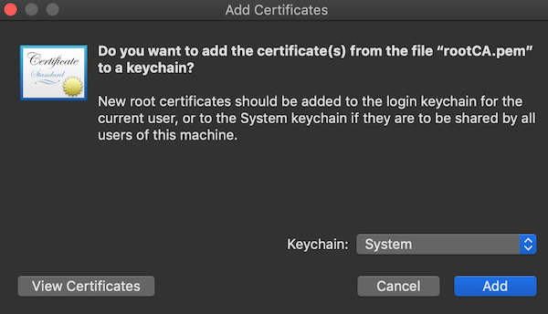{: style="width:400px"}  
    2. Open 'Keychain' app:  
    _<small>Click image to expand</small>_  
    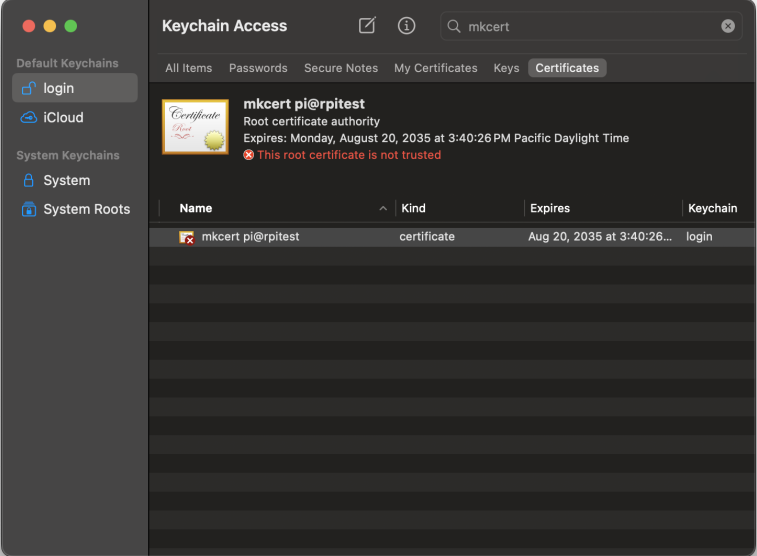{: style="width:400px"}  
    3. Set this certificate to "Always trust" to avoid browser warnings.  
    _<small>Click image to expand</small>_  
    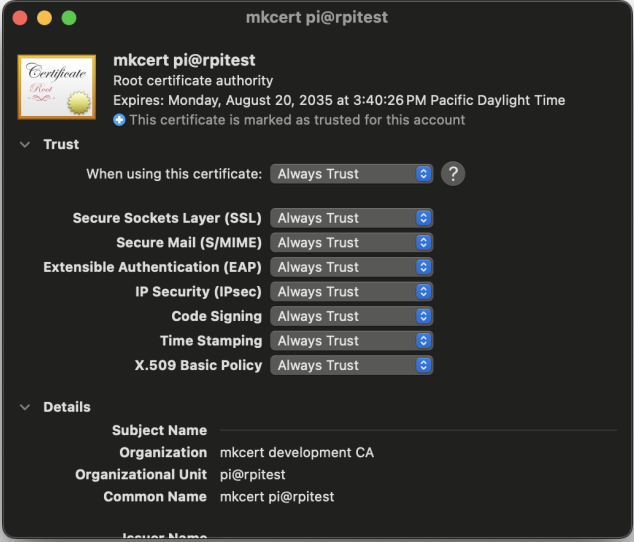{: style="width:400px"}  
    4. Finally, enter the address `https://raspap.local` in your browser and enjoy an encrypted SSL connection to RaspAP.

=== "Windows"
    !!! Note
        These instructions are based from Windows 11 Home, so your instructions may differ.
    1. Rename the downloaded `rootCA.pem` file to `rootCA.crt` (note the extension changed to `.crt`)  
    2. Double-click the `rootCA.crt` file to open it  
    3. On the window that opens, click the 'Install Certificate' (1) button:  
    _<small>Click image to expand</small>_  
    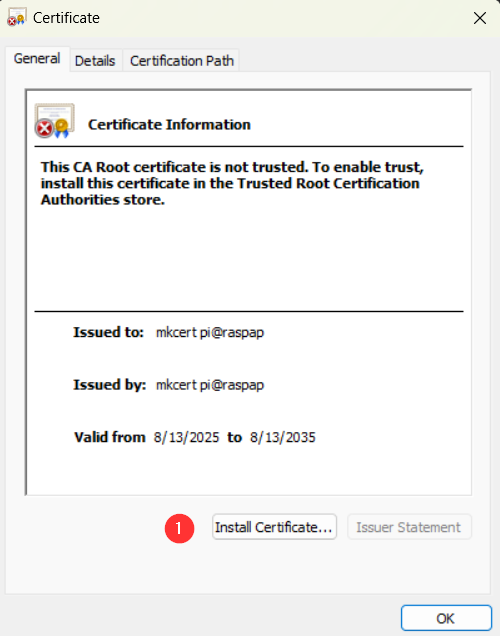{: style="width:200px"}  
    4. Change the 'Store Location' option to 'Local Computer' (1), then click 'Next' (2) on this 'Welcome to the Certificate Import Wizard' window (**Note:** you will likely be presented with a 'User Access Control' window, you will want to choose 'Yes' on this):  
    _<small>Click image to expand</small>_  
    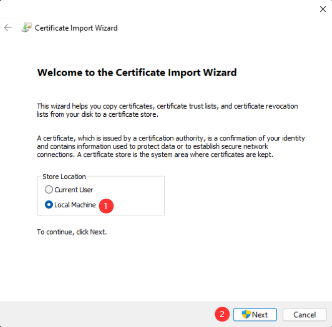{: style="width:200px"}  
    5. Select 'Place all certificaes in the following store' (1) then click the 'Browse...' button (2) on this window:  
    _<small>Click image to expand</small>_  
    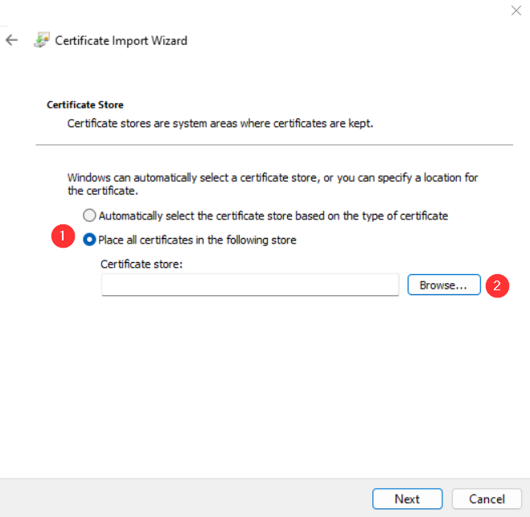{: style="width:200px"}  
    6. Choose the 'Trusted Root Certificate Authority' (1) certificate store then click 'OK' (2) on the 'Select Certifcate Store' pop-up box:  
    _<small>Click image to expand</small>_  
    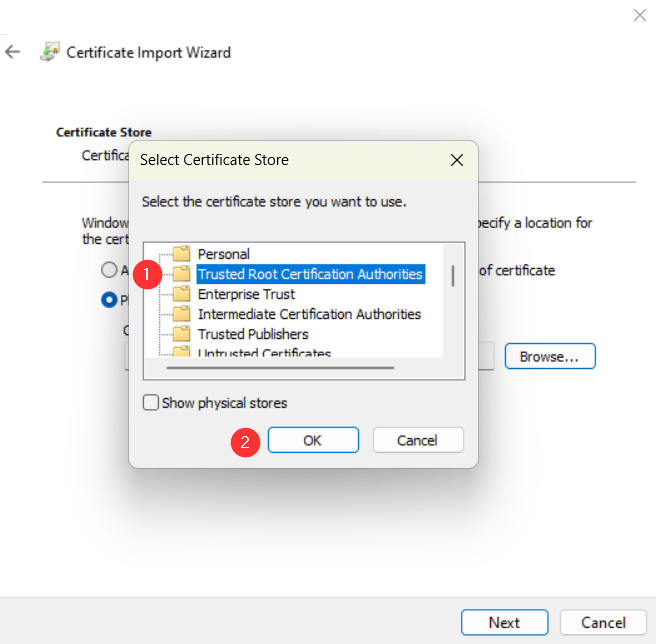{: style="width:200px"}  
    7. Ensure that the 'Trusted Root Certificate Authority' Certificate store is in the box (1) - if not correct it by browsing to the correct one - then click the 'Next' button (2) to continue:  
    _<small>Click image to expand</small>_  
    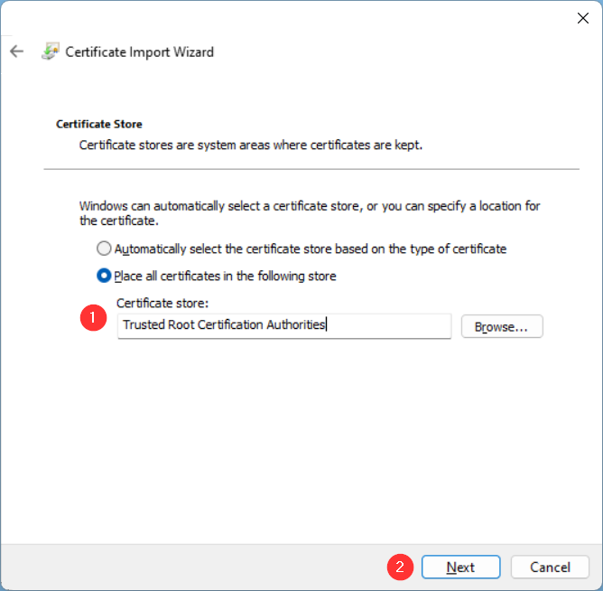{: style="width:200px"}  
    8. Ensure all information is correct on this final 'Completing the Certificate Import Wizard' window - if not, repeat steps above to correct any abnormalities - then click 'Finish' (1) to complete the certificate import:  
    _<small>Click image to expand</small>_  
    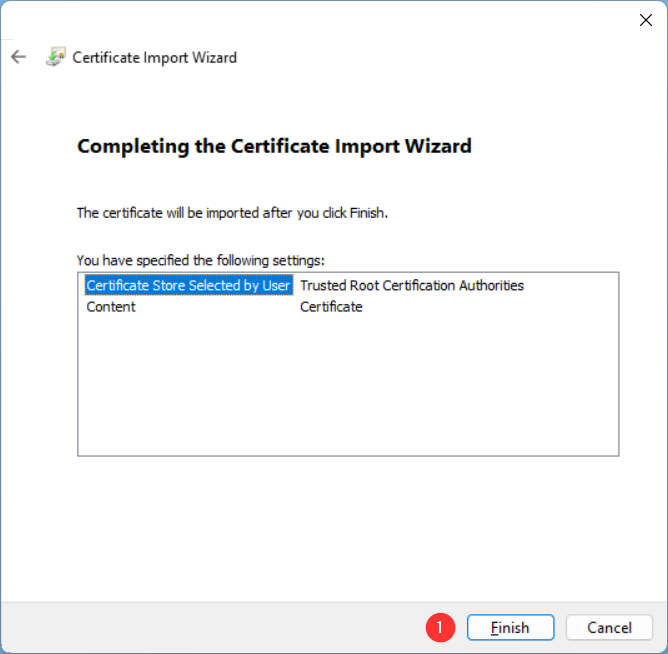{: style="width:200px"}  
    8. You should see this window pop-up - if you do not, something went wrong, and try again from the beginning of this document:  
    _<small>Click image to expand</small>_  
    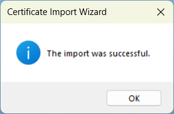{: style="width:200px"}  
    
    At this point, your computer should now trust the certificate chain, and you should be able to enter the address `https://raspap.local` in your browser and enjoy an encrypted SSL connection to RaspAP. However, if you want to confirm the certificate is loaded correctly, you can follow the steps in this note:
    
    !!! note "Note"   
        1. If you want to ensure that the new certifcate was installed correctly, navigate to the 'Manage computer certificates' control panel tool by opening the 'Start Menu' (1) and typing in `cert` (2) and selecting 'Manage computer certifcates' match (3):  
        _<small>Click image to expand</small>_  
        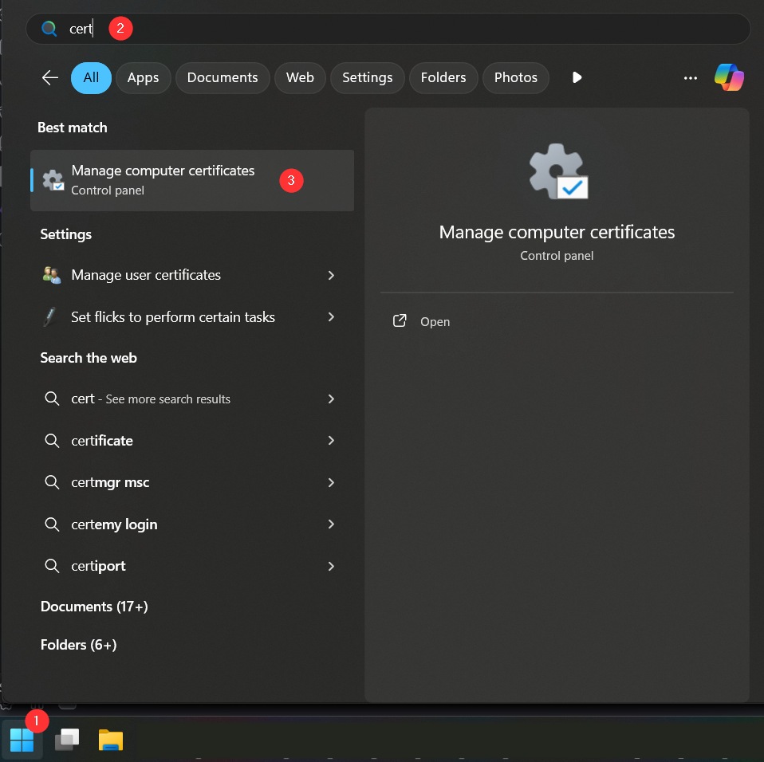{: style="width:640px"}  
        2. In this 'Certificates' window, navigate to and expand the 'Trusted Root Certificate Authority' (1) folder, then click on the 'Certificates' (2) store, and locate the newly installed certifcate that matches the one you chose to install (3):  
        _<small>Click image to expand</small>_  
        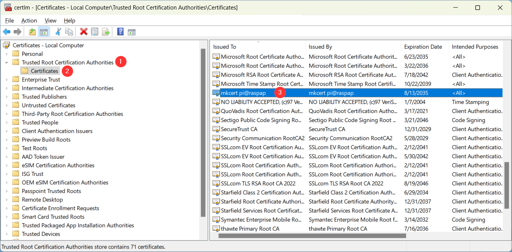{: style="width:640px"}  

=== "Linux (Ubuntu)"
    !!! Note
        These instructions are based from Ubuntu 22.04 LTS, so your instructions may differ.
    1. Run the following commands:
    ```bash
    sudo cp rootCA.pem /usr/local/share/ca-certificates/
    sudo update-ca-certificates
    ```
      a. If you get an error when trying to run the second command, then you likely need to install the CA Certificates package:
      ```bash
      sudo apt update
      sudo apt install ca-certificates -y
      ```
      b. Now you should be able to re-run the `sudo update-ca-certificates` command
    2. Enter the address `https://raspap.local` in your browser and enjoy an encrypted SSL connection to RaspAP.

=== "iOS/iPadOS"
    !!! Note
        These instructions are based from iOS v18.5, so your instructions may differ. If you experience issues, please check out [this mkcert post](https://github.com/FiloSottile/mkcert/issues/233#issuecomment-690110809) for some more information.
    1. Transfer the certificate to the device using AirDrop, email, or download using the router's link mentioned above.
    2. Open (1) the certificate file using the `Files` app:  
    _<small>Click image to expand</small>_  
    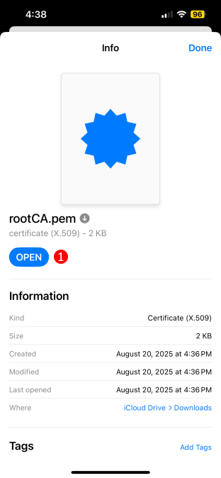{: style="width:200px"}  
    3. Go to 'Settings', then 'Profile Downloaded' (1):  
    _<small>Click image to expand</small>_  
    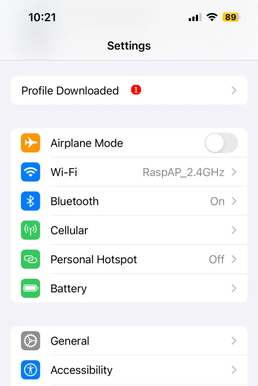{: style="width:200px"}  
    4. Then tap 'Install' (1) on the 'Install Profile' screen:  
    _<small>Click image to expand</small>_  
    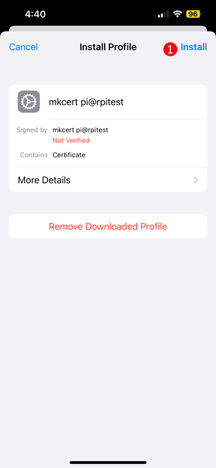{: style="width:200px"}  
      a. Enter your device passcode if prompted  
    5. Confirm by tapping 'Install' (1) again on the warning screen:  
    _<small>Click image to expand</small>_  
    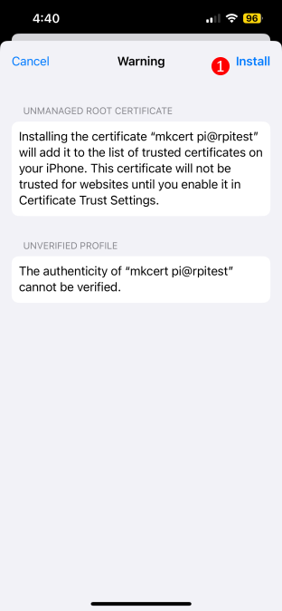{: style="width:200px"}  
    6. Enable Full Trust for Root Certificates  
      a. Go to 'Settings' → 'General' → 'About' → 'Certificate Trust Settings'  
      b. Toggle the switch ON (1) next to your certificate under 'Enable Full Trust for Root Certificates'  
      _<small>Click image to expand</small>_  
      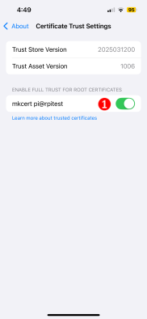{: style="width:200px"}  
    7. Finally, enter the address `https://raspap.local` in your browser and enjoy an encrypted SSL connection to RaspAP.
    
=== "Android"
    !!! Note
        These instructions are based from Android v14, so your instructions may differ.
    1. Navigate to 'Settings'  
    2. Search for `CA cert`:  
    _<small>Click image to expand</small>_  
    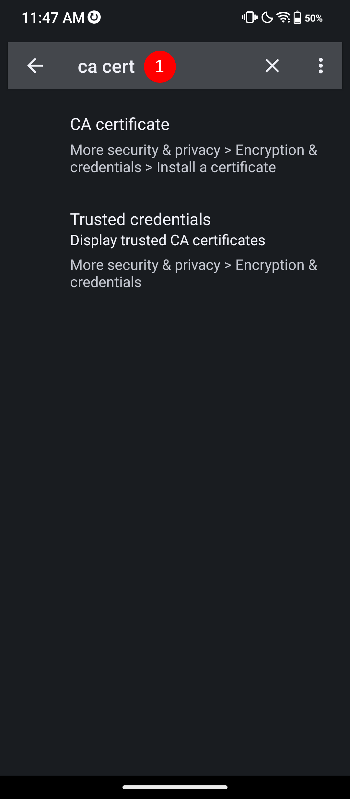{: style="width:200px"}  
    3. Select the 'CA certificate' result (1). This should load the 'Install a Certifcate' page; if so, select 'CA certificate':   
    _<small>Click image to expand</small>_  
    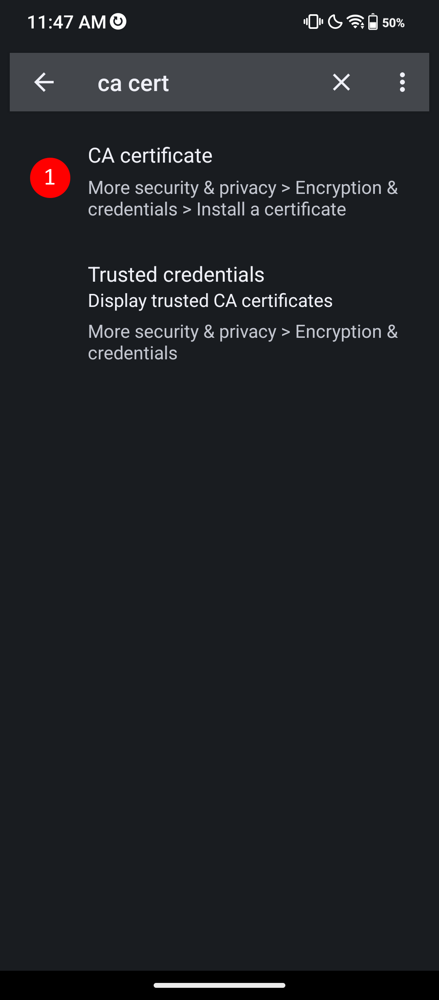{: style="width:200px"}  
    4. You will be presented with a warning screen. Please read it carefully, and select 'Install anyway' (1) if you agree with it:  
    _<small>Click image to expand</small>_  
    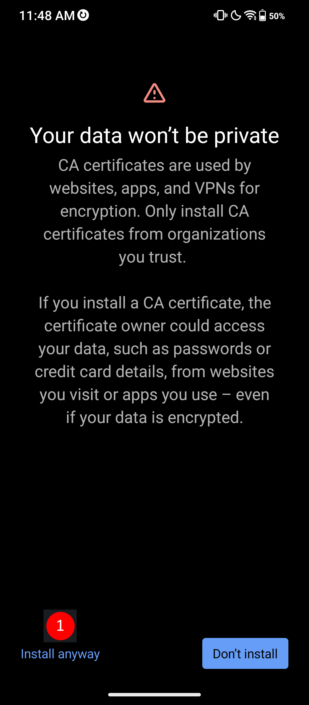{: style="width:200px"}  
      Note: If you have a lock (PIN or biometric) on your device, you will likely be prompted to authenticate after selecting this 
    5. Navigate to the certifcate file and select it:  
    _<small>Click image to expand</small>_  
    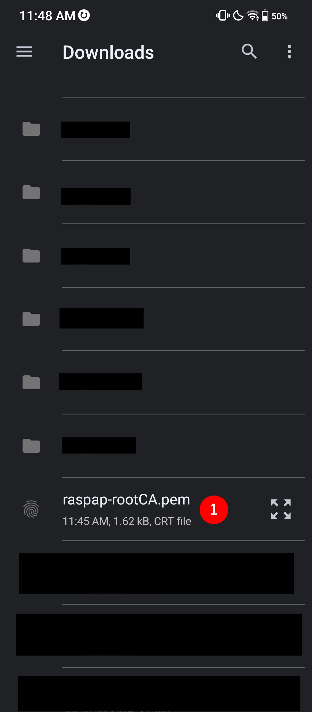{: style="width:200px"}  
    6. You should be sent back to the 'Install a certifcate' screen, but see a message popup at the bottom saying "CA certificate installed":  
    _<small>Click image to expand</small>_  
    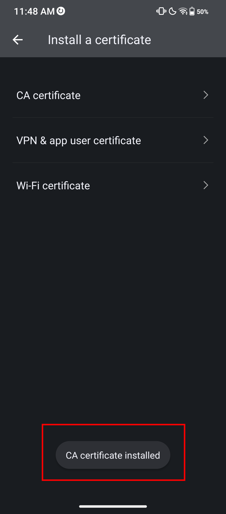{: style="width:200px"}  
    
    At this point, your computer should now trust the certificate chain, and you should be able to enter the address `https://raspap.local` in your browser and enjoy an encrypted SSL connection to RaspAP. However, if you want to confirm the certificate is loaded correctly, you can follow the steps in this note:

    ??? note "Note (click to expand/collapse)"
        1. In settings, under the search for `CA cert`, select the 'Trusted credentials' option (1):  
        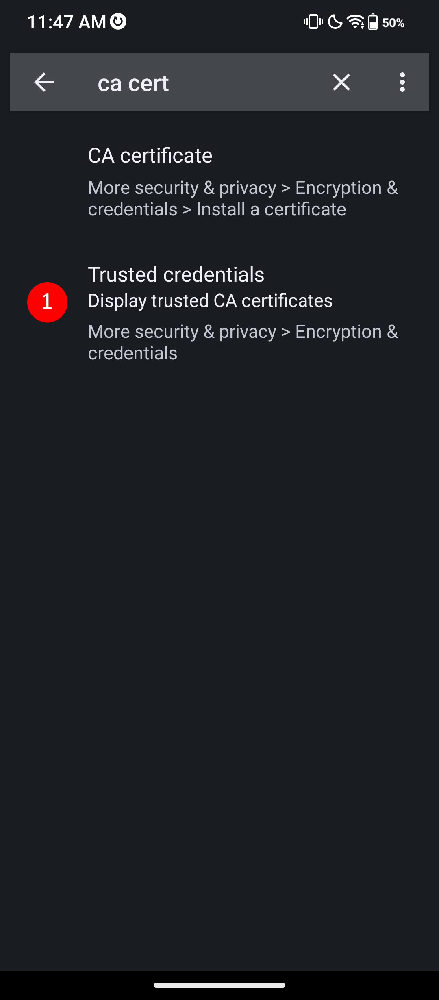{: style="width:200px"}  
        _<small>Click image to expand</small>_  
        2. This should direct you to the 'Encryption & Credentials' settings page; select the 'Trusted credentials' option (1):  
        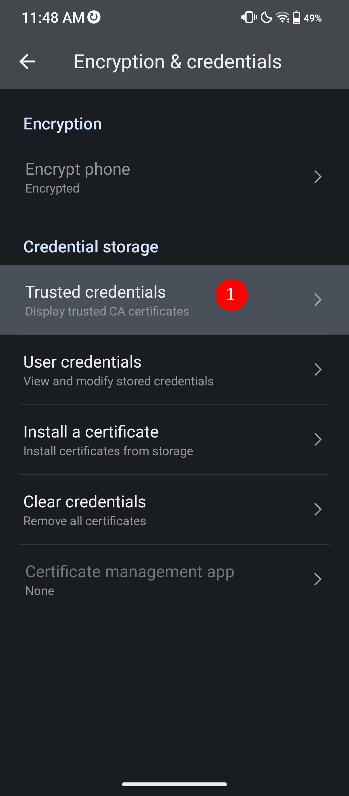{: style="width:200px"}  
        _<small>Click image to expand</small>_  
        2. On this 'Trusted credentials' page, select the 'User' button (1). You should see your installed certificate:  
        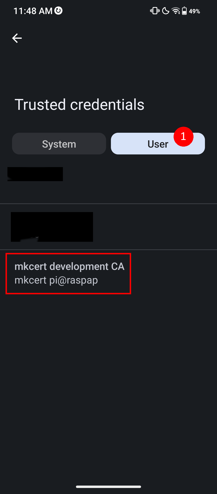{: style="width:200px"}  
        _<small>Click image to expand</small>_  

---

More `mkcert` advanced topics are [covered at mkcert](https://github.com/FiloSottile/mkcert#advanced-topics).
 
## Discussions
Questions or comments about using SSL certificates? Join the [discussion here](https://github.com/RaspAP/raspap-webgui/discussions/).

