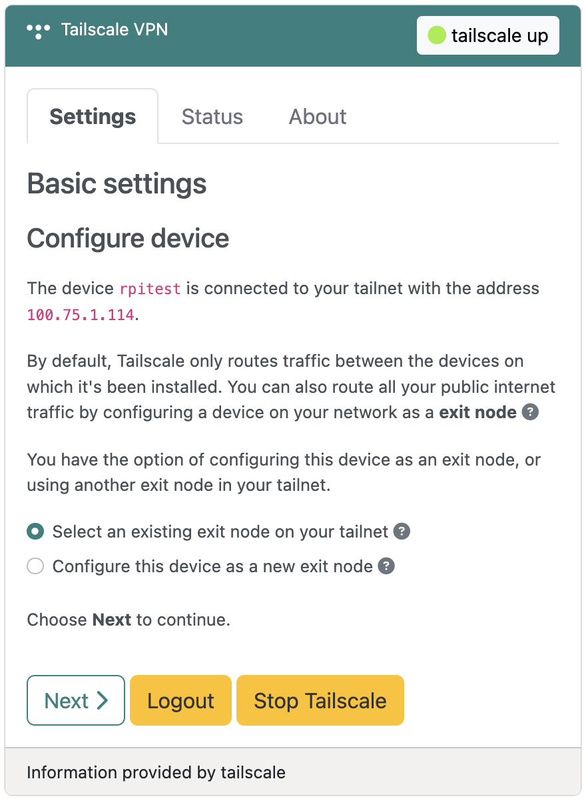
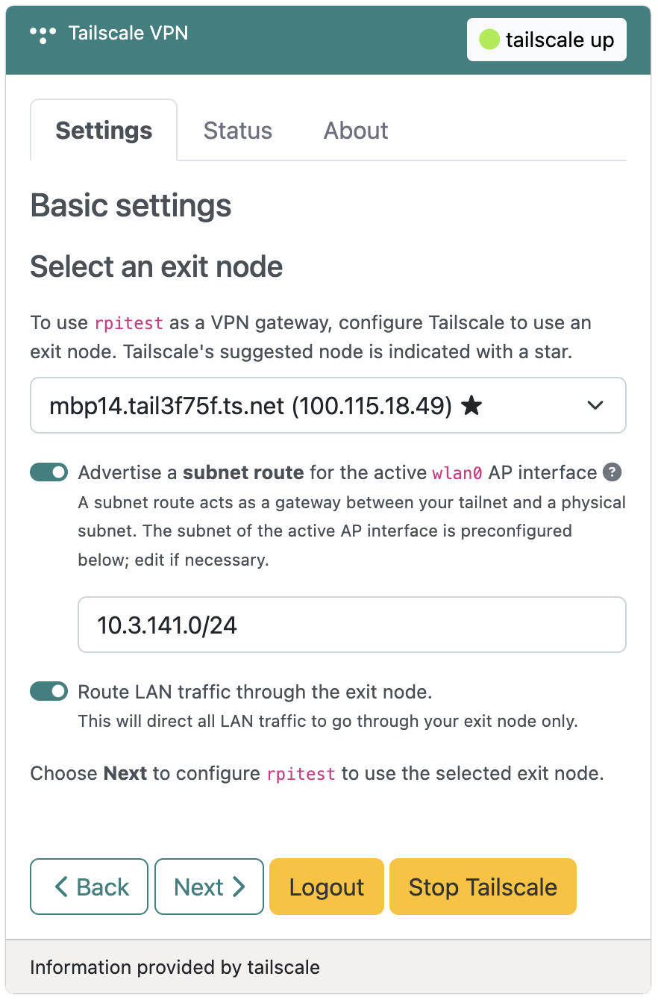
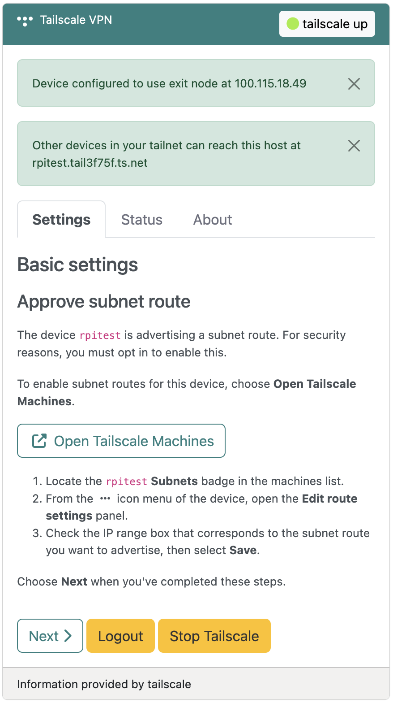
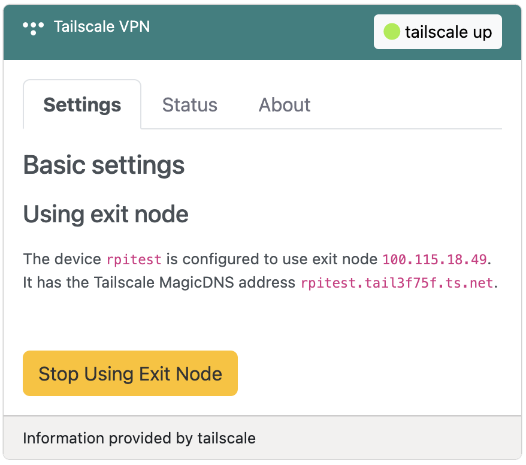
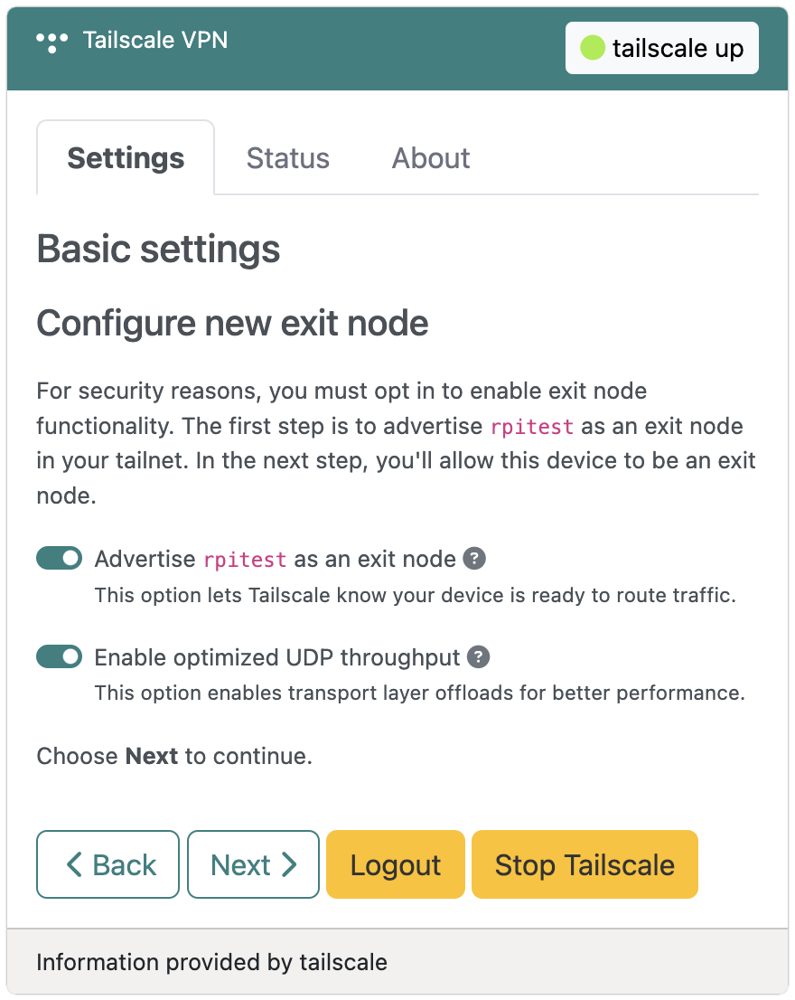
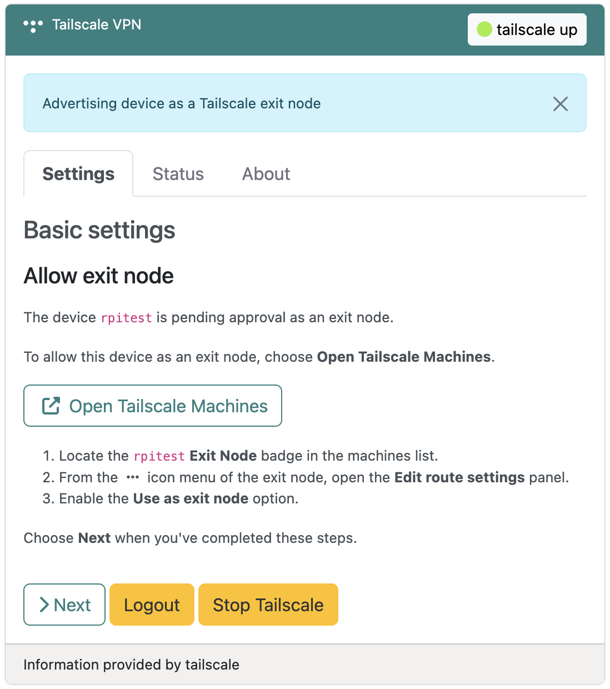
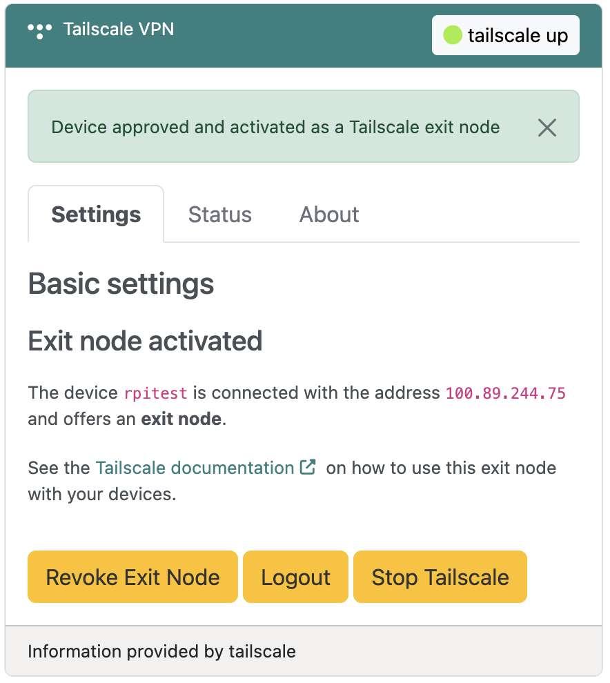
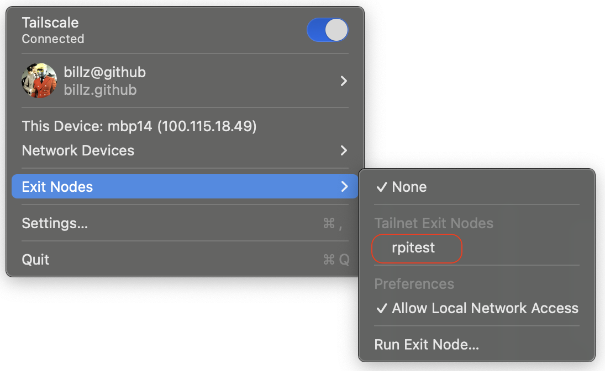

# Tailscale VPN

{: style="width:640px"}

## Overview
:octicons-beaker-24: Experimental · :octicons-heart-fill-24:{: .heart } [Insiders only](insiders.md)

Tailscale is a zero-configuration VPN that makes devices and services feel like they're on the same secure network, known as a _tailnet_, regardless of physical location. It builds on the secure and open source [WireGuard protocol](wireguard.md) to create encrypted peer-to-peer connections between devices. Tailscale bypasses the need for traditional VPNs while offering simplified access controls and management through user-friendly interfaces.

## Solution
Tailscale's default behavior is to act as an overlay network. That is, it routes traffic between devices running Tailscale, but doesn't act on your public internet traffic. The overlay network works well for secure communication between devices, but without the need for extra layers of encryption for a public internet connection.

However, there are times when you may want Tailscale to route your public internet traffic, such as in these scenarios:

1. When using an untrusted public Wi-Fi connection. 
2. While traveling abroad and need to access sensitive services (such as banking).
3. When access to region-restricted content is needed.

You're able to route all your public internet traffic by configuring a device on your network, such as a Raspberry Pi, as an _exit node_. Alternatively, you can also configure your Pi to use an existing exit node on your network. In this setup you may share connectivity with AP clients, effectively creating a Tailscale VPN router.

### Exit node benefits
An exit node secures all your traffic, including traffic to internet sites and applications. When you route all traffic through an exit node, you're effectively using default routes (`0.0.0.0/0`, `::/0`), similar to how you would if you were using a typical VPN. 

!!! tip Tip
    The Raspberry Pi 5, with its Broadcom BCM54210 network controller, is capable of ethernet speeds of up to 2.5 Gigabits/s (2500 Mbps). This is a 2.5x improvement in wired networking performance over the Raspberry Pi 4. Both devices are suitable for hosting an exit node, but if you need maximum throughput, best results are obtained with a Raspberry Pi 5 or similar Debian-capable device.

This insures that internet traffic is secured for all the devices connected in your tailnet, regardless of the physical network they're using (ethernet, wireless, cellular, and so on).

## Installation
RaspAP's Tailscale VPN integration is available as an Insiders-only plugin that may be installed from the **System > Plugins** tab. Simply choose **Details** corresponding to the plugin, then **Install now** from the pop-up dialog. 

The plugin installer automates adding GPG signing keys for the official Tailscale packages, updating your system `apt` cache and installing the dependencies. When these steps are done, the installer will automatically refresh the UI. The Tailscale plugin will then appear in the sidebar and is immediately available to configure.

## Basic settings
When configuring the plugin for the first time, you will be prompted to login to Tailscale. Choosing the :octicons-link-external-16: **Open Tailscale Login** button will open a new window for you. Complete the login with Tailscale and follow the prompts to connect your device. After authorizing your device to connect to Tailscale, choose **Next**:octicons-chevron-right-16: in RaspAP's Tailscale plugin.

{: style="width:400px"}

After you've logged in and connected your device to Tailscale, it will receive an IPv4 address within your tailnet (your private Tailscale network). At this stage, you may choose to create a new exit node or configure your device to use an existing one, as indicated above.

### Selecting an existing exit node
Any device capable of running Tailscale's client software is able to host an exit node on your tailnet. This includes mobile handsets, laptops and PCs; meaning you can configure an exit node on any of these devices in a location of your choosing and allow RaspAP to use it.

!!! note Note
    For this option, you must have at least one active device in your tailnet that offers an exit node. If you're unsure how to do this, refer to "[configuring an exit node](https://tailscale.com/kb/1103/exit-nodes#configure-an-exit-node)" in Tailscale's documentation.

If you have multiple active exit nodes on your tailnet, Tailscale will recommend one based on its network response time. This is indicated with a star :material-star: in the option list, as shown below: 

{: style="width:400px"}

_Subnet routes_ let you extend your Tailscale network to devices that don't run the Tailscale client. If you're hosting an AP on this device, selecting the **Advertise a subnet route** option will create a gateway between your tailnet and a physical subnet. The subnet associated with the active AP interface is preconfigured for you.

To **route LAN traffic through the exit node**, select the corresponding option, as shown above. This permits internet traffic originating on `eth0`, as well as any other LAN traffic to be routed through the exit node.

Both of these options above are recommended if you're using this device as a Tailscale VPN router. After selecting your options, choose **Next**:octicons-chevron-right-16: to proceed.

#### Approving subnet routes
For security reasons, you must opt in to enable Tailscale subnet route functionality. To do so, use the :octicons-link-external-16: **Open Tailscale Machines** button and follow the steps to approve the subnet route for this device, as indicated below:

{: style="width:400px"}

After completing these steps in the Tailscale console, choose **Next**:octicons-chevron-right-16: to proceed.

#### Using an exit node 
At the final step, the plugin will confirm that your device is using the exit node indicated by its Tailscale IPv4 address, as shown below: 

{: style="width:400px"}

Additionally, your device's Tailscale [MagicDNS](https://tailscale.com/kb/1081/magicdns) name is also indicated. 

!!! tip Tip
    With your device connected to a Tailscale exit node, it's recommended to access it via its MagicDNS name. Attempting to access it via your local network's IPv4 address or hostname (for example, `raspap.local`) may not work while connected to your tailnet. Accessing RaspAP from it's MagicDNS name will require you to authenticate again. 

To stop using the exit node with your device, choose **Stop Using Exit Node**.

### Configuring a new exit node
RaspAP's Tailscale integration also lets you configure your device as a new exit node. This is a good option if, for example, you wish to host a dedicated exit node in a specific location and allow devices with Tailscale's client software to connect to it. RaspAP streamlines the exit node configuration process for you, as described in the next sections.

#### Advertising an exit node
The first step is to advertise your device as an exit node on your tailnet. By doing so, clients that connect to it will have a secure tunnel through your tailnet and appear to have the Tailscale IPv4 address of your device. 

{: style="width:400px"}

To advertise your device as an exit node, accept the default setting as shown above. Optionally, you may also optimize your device for UDP throughput (recommended). Choose **Next**:octicons-chevron-right-16: to continue. 

!!! tip Tip
    Being based on WireGuard, Tailscale exclusively uses UDP as its transport protocol. For exit nodes, UDP throughput can be optimized by enabling generic receive offload (GRO) forwarding to reduce CPU overhead. This is recommended for Tailscale exit nodes with Linux 6.2 or later kernels. By enabling this option, RaspAP executes `ethtool` with `rx-udp-gro-forwarding`. To make this setting persistent after subsequent reboots, the plugin will also enable a `systemd` service to manage this automatically.

#### Allowing an exit node
At this stage, your device is pending approval as an exit node. For security reasons, you must opt in to enable exit node functionality. This includes the following actions:

1. A device must advertise itself as an exit node.
2. A Tailscale owner or admin must allow a device to be an exit node for the tailnet.
3. Every device must explicitly opt in to using an exit node.

Choose :octicons-link-external-16: **Open Tailscale Machines** to manage the devices connected to your tailnet:

{: style="width:400px"}

Follow the steps indicated above in the Tailscale console. Choose **Next**:octicons-chevron-right-16: when you've completed them.

#### Exit node activated
At the final step, your device will indicate that it offers an exit node. For security reasons, each of your devices must enable the exit node separately.

{: style="width:400px"}

Follow the **Tailscale documentation** :octicons-link-external-16: link for instructions on how to use this exit node with the devices in your tailnet.

#### Connecting clients
Tailscale has support for Android, iOS, Linux, macOS, tvOS and Windows devices. You may opt to configure all of your devices, or a subset of them, to [use your exit node](https://tailscale.com/kb/1103/exit-nodes#use-the-exit-node) by installing Tailscale's client software. 

{: style="width:460px"}

In the example above, a macOS client is connected to Tailscale and is using the exit node `rpitest` configured in the preceding steps.

## Obtaining a status
The Tailscale plugin **Status** tab displays the current operational status of your tailnet. This includes a summary of authorized devices, their IPv4 addresses, operating system, exit node status and so on:

```
100.89.244.75   rpitest     billz@     linux   idle; offers exit node
100.115.18.49   mbp14       billz@     macOS   active; direct 192.168.1.254:41641, tx 13724 rx 25444
100.117.241.50  samsung     billz@     android offline
```

In the example status output above, `rpitest` offers an exit node and a macOS device has an active connection.

## Troubleshooting
Basic troubleshooting steps are included here to help you diagnose common problems. Before proceeding, start by confirming that the Tailscale plugin **Status** tab shows that your device is connected to your tailnet. If your device doesn't appear in the status output, choose **Logout** and try connecting to your tailnet again. 

### No internet connectivity
One of the most common issues is clients being unable to access the internet through your exit node. This is often due to a missing IP forwarding or NAT configuration on the exit node:

```
# Check if IP forwarding is enabled
cat /proc/sys/net/ipv4/ip_forward
# Should return 1, if not, enable it:
sudo sysctl -w net.ipv4.ip_forward=1
sudo sysctl -w net.ipv6.conf.all.forwarding=1

# Add NAT rule
NETDEV=$(ip -o route get 8.8.8.8 | cut -f 5 -d " ")
sudo iptables -t nat -A POSTROUTING -o $NETDEV -j MASQUERADE
```

RaspAP configures both IP forwarding and NAT by default, as shown above, so this should only be neccesary in rare cases.

### Verifying exit node traffic
You may wish to verify that public internet traffic is being routed from devices in your tailnet through your exit node. To do so, update your system's `apt` cache and install the `tcpdump` package, like so:

```
sudo apt update
sudo apt install tcpdump -y
```

The `tcpdump` utility is packet analyzer that allows capture, display, and analysis of network traffic passing through a given interface. Execute the tool as shown below, specifying the `tailscale0` interface with the `-i` option: 


```
sudo tcpdump -i tailscale0
tcpdump: verbose output suppressed, use -v[v]... for full protocol decode
listening on tailscale0, link-type RAW (Raw IP), snapshot length 262144 bytes
...
```

With one or more active devices connected to your exit node, you should see a continuous stream of UDP traffic. Interrupt the output with ++ctrl+c++.

If no traffic appears on the `tailscale0` interface, review the machines in the [Tailscale console](https://login.tailscale.com/admin/machines) and confirm that the **Exit Node** badge appears next to your device.

### Administering machines
RaspAP's Tailscale integration provides a convenient frontend to Tailscale via its Linux [command-line interface (CLI)](https://tailscale.com/kb/1080/cli). If you're unsure of the current status of your device in the tailnet, or have difficult accessing it, authenticate with Tailscale and [manage the machines in your tailnet](https://login.tailscale.com/admin/machines). You may revoke or modify exit node and/or subnet settings from the console, edit a machine's IPv4 address or remove it from your tailnet.

Check the Tailscale console before creating an issue or starting a discussion related to RaspAP's Tailscale plugin.

## Discussions
Questions or comments about using Tailscale? Join the [discussion here](https://github.com/RaspAP/raspap-webgui/discussions/).
